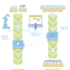

---

# One Research Framework

`One` is a comprehensive research framework and knowledge base of our works 
related to computer vision, machine learning, and deep learning.

[Getting Started](#getting-started) &nbsp;
[Knowledge Base](#knowledge-base) &nbsp;
[Cite](#cite) &nbsp;
[Contact](#contact)

---

## Getting Started

### Prerequisite

|            | Requirements                                                                                                                                                                                                                                         |
|:-----------|:-----------------------------------------------------------------------------------------------------------------------------------------------------------------------------------------------------------------------------------------------------|
| **OS**     | [**Ubuntu 20.04 / 22.04**](https://ubuntu.com/download/desktop) (fully supports), `Windows 10` and `MacOS` (partially supports)                                                                                                                      |
| **Env**    | [**Python>=3.9.0**](https://www.python.org/), [**PyTorch>=1.11.0**](https://pytorch.org/get-started/locally/), [**cudatoolkit=11.3**](https://pytorch.org/get-started/locally/), with [**anaconda**](https://www.anaconda.com/products/distribution) |	
| **Editor** | [**PyCharm**](https://www.jetbrains.com/pycharm/download)                                                                                                                                                                                            |

### Directory

```text
one               # root directory
 |__ data         # contains data
 |__ docs
 |__ install      # helpful installation scripts       
 |__ pretrained   # pretrained models weights
 |__ scripts      # main scripts
 |__ src
 |      |__ one
 |      |__ project1
 |      |__ project2
 |      |__ ..
 |__ tests
 |__ third_party
```

### Installation using `conda`

```shell
cd <to-where-you-want-to-save-one-dir>
mkdir -p one
mkdir -p one/data
cd one

# Install `aic22_track4` package
git clone git@github.com:phlong3105/one
cd one/install
chmod +x install.sh
conda init bash

# Install package. When prompt to input the dataset directory path, you should 
# enter: <some-path>/one/datasets
bash -i install.sh
cd ..
pip install --upgrade -e .
```

## Knowledge Base

### [Machine Learning](https://phlong3105.github.io/one/machine_learning)

|                                                                                                                                                                                                                                      |                                                                                                                                                                                                              |                                                                                                                                                                                                  |
|:------------------------------------------------------------------------------------------------------------------------------------------------------------------------------------------------------------------------------------------------------:|:------------------------------------------------------------------------------------------------------------------------------------------------------------------------------------------------------------------------------:|:------------------------------------------------------------------------------------------------------------------------------------------------------------------------------------------------------------------:|
| [](https://phlong3105.github.io/one/machine_learning/data_processing) <br> [**Data Processing**](https://phlong3105.github.io/one/machine_learning/data_processing) | [](https://phlong3105.github.io/one/machine_learning/model_learning) <br> [**Training**](https://phlong3105.github.io/one/machine_learning/model_learning) | [](https://phlong3105.github.io/one/machine_learning/model_serving) <br> [**Serving**](https://phlong3105.github.io/one/machine_learning/model_serving) |
|                           [](https://phlong3105.github.io/one/machine_learning/classification) <br> [**Classification**](https://phlong3105.github.io/one/machine_learning/classification)                            |                       [](https://phlong3105.github.io/one/machine_learning/clustering) <br> [**Clustering**](https://phlong3105.github.io/one/machine_learning/clustering)                        |           [](https://phlong3105.github.io/one/machine_learning/deep_learning) <br> [**Deep Learning**](https://phlong3105.github.io/one/machine_learning/deep_learning)            |
|     [](https://phlong3105.github.io/one/machine_learning/dimensionality_reduction) <br> [**Dimensionality <br> Reduction**](https://phlong3105.github.io/one/machine_learning/dimensionality_reduction)     |          [](https://phlong3105.github.io/one/machine_learning/neural_network) <br> [**Neural Network<br>&nbsp;**](https://phlong3105.github.io/one/machine_learning/neural_network)           |            [](https://phlong3105.github.io/one/machine_learning/regression) <br> [**Regression<br>&nbsp;**](https://phlong3105.github.io/one/machine_learning/regression)             |

### [Vision](https://phlong3105.github.io/one/vision)

|                                                                                                                                                                                                                                                 |                                                                                                                                                                                                                                                 |                                                                                                                                                                                                            |
|:-----------------------------------------------------------------------------------------------------------------------------------------------------------------------------------------------------------------------------------------------------------------:|:-----------------------------------------------------------------------------------------------------------------------------------------------------------------------------------------------------------------------------------------------------------------:|:----------------------------------------------------------------------------------------------------------------------------------------------------------------------------------------------------------------------------:|
|         [](https://phlong3105.github.io/one/vision/action_recognition) <br> [**Action Recognition<br>&nbsp;**](https://phlong3105.github.io/one/vision/action_recognition)         |             [](https://phlong3105.github.io/one/vision/action_detection) <br> [**Action Detection<br>&nbsp;**](https://phlong3105.github.io/one/vision/action_detection)              |           [](https://phlong3105.github.io/one/vision/image_classification) <br> [**Image<br>Classification**](https://phlong3105.github.io/one/vision/image_classification)           |
|              [](https://phlong3105.github.io/one/vision/image_enhancement) <br> [**Image<br>Enhancement**](https://phlong3105.github.io/one/vision/image_enhancement)              | [](https://phlong3105.github.io/one/vision/instance_segmentation) <br> [**Instance <br> Segmentation**](https://phlong3105.github.io/one/vision/instance_segmentation) | [](https://phlong3105.github.io/one/vision/lane_detection) <br> [**Lane Detection<br>&nbsp;**](https://phlong3105.github.io/one/vision/lane_detection) |
|                  [](https://phlong3105.github.io/one/vision/object_detection) <br> [**Object Detection**](https://phlong3105.github.io/one/vision/object_detection)                   |                                         [](https://phlong3105.github.io/one/vision/object_tracking) <br> [**Object Tracking**](https://phlong3105.github.io/one/vision/object_tracking)                                         |                    [](https://phlong3105.github.io/one/vision/reidentification) <br>  [**Reidentification**](https://phlong3105.github.io/one/vision/reidentification)                    |
| [](https://phlong3105.github.io/one/vision/semantic_segmentation) <br> [**Semantic <br> Segmentation**](https://phlong3105.github.io/one/vision/semantic_segmentation) |                                                                                                                                                                                                                                                                   |                                                                                                                                                                                                                              |

### [Image Processing](https://phlong3105.github.io/one/image_processing)

|                                                                                                                                                                                                 |                                                                                                                                                                                                 |                                                                                                                                                                                         |
|:-----------------------------------------------------------------------------------------------------------------------------------------------------------------------------------------------------------------:|:-----------------------------------------------------------------------------------------------------------------------------------------------------------------------------------------------------------------:|:---------------------------------------------------------------------------------------------------------------------------------------------------------------------------------------------------------:|
| [](https://phlong3105.github.io/one/image_processing/camera_calibration) <br> [**Camera Calibration**](https://phlong3105.github.io/one/image_processing/camera_calibration) | [](https://phlong3105.github.io/one/image_processing/feature_extraction) <br> [**Feature Extraction**](https://phlong3105.github.io/one/image_processing/feature_extraction) |               [](https://phlong3105.github.io/one/image_processing/filtering) <br> [**Filtering**](https://phlong3105.github.io/one/image_processing/filtering)               |
|                   [](https://phlong3105.github.io/one/image_processing/histogram) <br> [**Histogram**](https://phlong3105.github.io/one/image_processing/histogram)                   |                       [](https://phlong3105.github.io/one/image_processing/spatial) <br> [**Spatial**](https://phlong3105.github.io/one/image_processing/spatial)                       | [](https://phlong3105.github.io/one/image_processing/spatial_temporal) <br> [**Spatial Temporal**](https://phlong3105.github.io/one/image_processing/spatial_temporal) |

### [Tools](https://phlong3105.github.io/one/tools)

|                                                                                                                                                  |                                                                                                                                        |                                                                                                                                   |
|:------------------------------------------------------------------------------------------------------------------------------------------------------------------:|:--------------------------------------------------------------------------------------------------------------------------------------------------------:|:---------------------------------------------------------------------------------------------------------------------------------------------------:|
| [](https://phlong3105.github.io/one/tools/anaconda) <br> [**Anaconda**](https://phlong3105.github.io/one/tools/anaconda) | [](https://phlong3105.github.io/one/tools/docker) <br> [**Docker**](https://phlong3105.github.io/one/tools/docker) | [](https://phlong3105.github.io/one/tools/swift) <br> [**Swift**](https://phlong3105.github.io/one/tools/swift) |
|      [](https://phlong3105.github.io/one/tools/python) <br> [**Python**](https://phlong3105.github.io/one/tools/python)      |                                                                                                                                                          |                                                                                                                                                     |

## Projects

### [Challenges](https://phlong3105.github.io/one/challenges)

|                                                                                                                                                                      |                                                                                                                                                |                                                                                                                                                                            |
|:------------------------------------------------------------------------------------------------------------------------------------------------------------------------------------:|:--------------------------------------------------------------------------------------------------------------------------------------------------------------:|:------------------------------------------------------------------------------------------------------------------------------------------------------------------------------------------:|
| [](https://phlong3105.github.io/one/challenges/ai_city) <br> [**AI City**](https://phlong3105.github.io/one/challenges/ai_city) |   [](https://phlong3105.github.io/one/challenges/autonue) <br> [**AutoNue**](https://phlong3105.github.io/one/challenges/autonue)    | [](https://phlong3105.github.io/one/challenges/chalearn) <br> [**ChaLearn**](https://phlong3105.github.io/one/challenges/chalearn) |
|                [](https://phlong3105.github.io/one/challenges/katech) <br> [**KATECH**](https://phlong3105.github.io/one/challenges/katech)                 |       [](https://phlong3105.github.io/one/challenges/kodas) <br> [**KODAS**](https://phlong3105.github.io/one/challenges/kodas)        |                       [](https://phlong3105.github.io/one/challenges/nico) <br> [**NICO**](https://phlong3105.github.io/one/challenges/nico)                        |
 |                  [](https://phlong3105.github.io/one/challenges/ntire) <br> [**NTIRE**](https://phlong3105.github.io/one/challenges/ntire)                   | [](https://phlong3105.github.io/one/challenges/ug2) <br> [**UG2+**](https://phlong3105.github.io/one/challenges/ug2) |               [](https://phlong3105.github.io/one/challenges/visdrone) <br> [**VisDrone**](https://phlong3105.github.io/one/challenges/visdrone)                |
 |            [](https://phlong3105.github.io/one/challenges/vipriors) <br> [**VIPriors**](https://phlong3105.github.io/one/challenges/vipriors)             |       [](https://phlong3105.github.io/one/challenges/waymo) <br> [**Waymo+**](https://phlong3105.github.io/one/challenges/waymo)       |                                                                                                                                                                                            |

### [Autonomous Vehicle](https://phlong3105.github.io/one/autonomous_vehicle)

|                                                                                                                                                                                                      |                                                                                                                                                                                                              |  |
|:--------------------------------------------------------------------------------------------------------------------------------------------------------------------------------------------------------------------:|:----------------------------------------------------------------------------------------------------------------------------------------------------------------------------------------------------------------------------:|:----------------:|
| [](https://phlong3105.github.io/one/autonomous_vehicle/autonomous_sensor) <br> [**Autonomous<br>Sensor**](https://phlong3105.github.io/one/autonomous_vehicle/autonomous_sensor) | [](https://phlong3105.github.io/one/autonomous_vehicle/scene_understanding) <br> [**Scene<br>Understanding**](https://phlong3105.github.io/one/autonomous_vehicle/scene_understanding) |                  |

### [Surveillance System](https://phlong3105.github.io/one/surveillance_system)

|                                                                                                                                                              |  |  |
|:----------------------------------------------------------------------------------------------------------------------------------------------------------------------------:|:----------------:|:----------------:|
| [](https://phlong3105.github.io/surveillance_system/edge_tss) <br>  [**Edge TSS**](https://phlong3105.github.io/one/surveillance_system/edge_tss) |                  |                  |

## Cite

If you find our work useful, please cite the following:

```text
@misc{Pham2022,  
    author       = {Long Hoang Pham},  
    title        = {One: One Research Framework},  
    publisher    = {GitHub},
    journal      = {GitHub repository},
    howpublished = {\url{https://github.com/phlong3105/one}},
    year         = {2022},
}
```

## Contact

If you have any questions, feel free to contact `Long Pham` 
([longpham3105@gmail](longpham3105@gmail) or [phlong@skku.edu](phlong@skku.edu))
