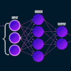

Handbook
=============================

## Overview

The `One Handbook` is a comprehensive knowledge base of our works related to
computer vision, machine learning, and deep learning. We summarize various types
of machine learning methods, related theory, and the best practices when
applying in competitive competitions and real-world applications.

## Knowledge Base

### [Machine Learning](machine_learning/README.md) 

|            [Data&nbsp;Processing](machine_learning/data_processing/README.md)            |        [Training-Testing](machine_learning/training/README.md)         |     [Model&nbsp;Serving](machine_learning/serving/README.md)     |
|:----------------------------------------------------------------------------------------:|:----------------------------------------------------------------------:|:----------------------------------------------------------------:|
|  |  |  |

| [Anomaly&nbsp;Detection](machine_learning/anomaly_detection/README.md) | [Classification](machine_learning/classification/README.md) | [Clustering](machine_learning/clustering/README.md) | [Deep&nbsp;Learning](machine_learning/deep_learning/README.md) | [Dimensionality&nbsp;Reduction](machine_learning/dimensionality_reduction/README.md) | [Neural&nbsp;Network](machine_learning/neural_network/README.md) |
|:----------------------------------------------------------------------:|:-----------------------------------------------------------:|:---------------------------------------------------:|:--------------------------------------------------------------:|:------------------------------------------------------------------------------------:|:----------------------------------------------------------------:|
|                               |                            |                        |                           |                                      |                            |

| [Regression](machine_learning/regression/README.md) | 
|:---------------------------------------------------:|
|                        | 

### [Vision](vision/README.md) 

|             [Action&nbsp;Recognition](vision/action_recognition/README.md)              |            [Action&nbsp;Detection](vision/action_detection/README.md)             | [Image&nbsp;Classification](vision/image_classification/README.md) |             [Image&nbsp;Enhancement](vision/image_enhancement/README.md)             |               [Instance&nbsp;Segmentation](vision/instance_segmentation/README.md)               |           [Lane&nbsp;Detection](vision/lane_detection/README.md)            |
|:---------------------------------------------------------------------------------------:|:---------------------------------------------------------------------------------:|:------------------------------------------------------------------:|:------------------------------------------------------------------------------------:|:------------------------------------------------------------------------------------------------:|:---------------------------------------------------------------------------:|
|  |  |                        |  |  |  |

|         [Object&nbsp;Detection](vision/object_detection/README.md)          | [Object&nbsp;Tracking](vision/object_tracking/README.md) | [Reidentification](vision/reidentification/README.md) |               [Semantic&nbsp;Segmentation](vision/semantic_segmentation/README.md)               | 
|:---------------------------------------------------------------------------:|:--------------------------------------------------------:|:-----------------------------------------------------:|:------------------------------------------------------------------------------------------------:|
|  |                   |                    |  | 

### [Image Processing](image_processing/README.md) 

| [Camera&nbsp;Calibration](image_processing/camera_calibration/README.md) | [Feature&nbsp;Extraction](image_processing/feature_extraction/README.md) | [Filtering](image_processing/filtering/README.md) | [Histogram](image_processing/histogram/README.md) | [Spatial](image_processing/spatial/README.md) | [Spatial Temporal](image_processing/spatial_temporal/README.md) |
|:------------------------------------------------------------------------:|:------------------------------------------------------------------------:|:-------------------------------------------------:|:-------------------------------------------------:|:---------------------------------------------:|:---------------------------------------------------------------:|
|                                 |                                |                       |                       |                     |                              |

### Tools 

|    [Anaconda ](tools/anaconda.md)    |    [Docker](tools/docker.md)     |    [Swift](tools/swift.md)     |    [Python](tools/python.md)     |
|:------------------------------------:|:--------------------------------:|:------------------------------:|:--------------------------------:|
|  |  |  |  |

## Projects

### [Challenges](challenges/README.md) 

|        [AI&nbsp;City](challenges/ai_city/README.md)        | [AutoNue](challenges/autonue/README.md) |        [ChaLearn](challenges/chalearn/README.md)         | [KATECH](challenges/katech/README.md) | [KODAS](challenges/kodas/README.md) | [NICO](challenges/nico/README.md) |
|:----------------------------------------------------------:|:---------------------------------------:|:--------------------------------------------------------:|:-------------------------------------:|:-----------------------------------:|:---------------------------------:|
|  |               |  |              |             |            |

| [NTIRE](challenges/ntire/README.md) |       [UG2+](challenges/ug2/README.md)       | [VisDrone](challenges/visdrone/README.md) | [VIPriors](challenges/vipriors/README.md) | [Waymo](challenges/waymo/README.md) |
|:-----------------------------------:|:--------------------------------------------:|:-----------------------------------------:|:-----------------------------------------:|:-----------------------------------:|
|             |    |                |                |             |

### [Autonomous Vehicle](autonomous_vehicle/README.md) 

| [Autonomous&nbsp;Sensor](autonomous_vehicle/autonomous_sensor/README.md) | [Scene&nbsp;Understanding](autonomous_vehicle/scene_understanding/README.md) |
|:------------------------------------------------------------------------:|:----------------------------------------------------------------------------:|
|                                 |                                   |

### [Surveillance System](surveillance_system/README.md) 

| [Edge&nbsp;TSS](surveillance_system/edge_tss/README.md) |
|:-------------------------------------------------------:|
|                         |
