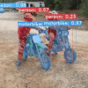
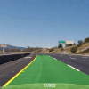
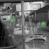

---

The `One Handbook` is a comprehensive knowledge base of our works related to 
computer vision, machine learning, and deep learning. We summarize various types 
of machine learning methods, related theory, and the best practices when 
applying in competitive challenges and real-world applications.

## Knowledge Base

### [Machine Learning](machine_learning/README.md)

|                                                                                                                                                                                                                  |                                                                                                                                                |                                                                                                                                    |
|:--------------------------------------------------------------------------------------------------------------------------------------------------------------------------------------------------------------------------------:|:--------------------------------------------------------------------------------------------------------------------------------------------------------------:|:--------------------------------------------------------------------------------------------------------------------------------------------------:|
|    [**Data Processing**](machine_learning/data_processing/README.md) |    [**Training**](machine_learning/learning/README.md) |    [**Serving**](machine_learning/serving/README.md) |
|                                          [**Classification**](machine_learning/classification/README.md)                                        |                 [**Clustering**](machine_learning/clustering/README.md)               |     [**Deep Learning**](machine_learning/deep_learning/README.md)   |
|                    [**Dimensionality   Reduction**](machine_learning/dimensionality_reduction/README.md)                 |    [**Neural Network &nbsp;**](machine_learning/neural_network/README.md)  |      [**Regression &nbsp;**](machine_learning/regression/README.md)    |
                                                                                                                                                                                                                                                                                        
### [Vision](vision/README.md)

|                                                                                                                                                                                                     |                                                                                                                                                                                                     |                                                                                                                                                                |
|:-------------------------------------------------------------------------------------------------------------------------------------------------------------------------------------------------------------------:|:-------------------------------------------------------------------------------------------------------------------------------------------------------------------------------------------------------------------:|:------------------------------------------------------------------------------------------------------------------------------------------------------------------------------:|
|            [**Action Recognition &nbsp;**](vision/action_recognition/README.md)         |                [**Action Detection &nbsp;**](vision/action_detection/README.md)              |              [**Image Classification**](vision/image_classification/README.md)           |
|                 [**Image Enhancement**](vision/image_enhancement/README.md)              |    [**Instance   Segmentation**](vision/instance_segmentation/README.md) |    [**Lane Detection &nbsp;**](vision/lane_detection/README.md) |
 |                     [**Object Detection**](vision/object_detection/README.md)                   |                                            [**Object Tracking**](vision/object_tracking/README.md)                                         |                        [**Reidentification**](vision/reidentification/README.md)                    |
 |    [**Semantic   Segmentation**](vision/semantic_segmentation/README.md) |                                                                                                                                                                                                                     |                                                                                                                                                                                |
 
### [Image Processing](image_processing/README.md)

|                                                                                                                                                     |                                                                                                                                                     |                                                                                                                                             |
|:-------------------------------------------------------------------------------------------------------------------------------------------------------------------:|:-------------------------------------------------------------------------------------------------------------------------------------------------------------------:|:-----------------------------------------------------------------------------------------------------------------------------------------------------------:|
|    [**Camera Calibration**](image_processing/camera_calibration/README.md) |    [**Feature Extraction**](image_processing/feature_extraction/README.md) |                  [**Filtering**](image_processing/filtering/README.md)               |
|                      [**Histogram**](image_processing/histogram/README.md)                   |                          [**Spatial**](image_processing/spatial/README.md)                       |    [**Spatial Temporal**](image_processing/spatial_temporal/README.md) |

### Tools

|                                                                                        |                                                                              |                                                                         |
|:------------------------------------------------------------------------------------------------------:|:--------------------------------------------------------------------------------------------:|:---------------------------------------------------------------------------------------:|
|    [**Anaconda**](tools/anaconda.md) |    [**Docker**](tools/docker.md) |    [**Swift**](tools/swift.md) |
|         [**Python**](tools/python.md)      |                                                                                              |                                                                                         |

## Projects

### [Challenges](challenges/README.md)

|                                                                                                                        |                                                                                                |                                                                                                                              |
|:--------------------------------------------------------------------------------------------------------------------------------------:|:--------------------------------------------------------------------------------------------------------------:|:--------------------------------------------------------------------------------------------------------------------------------------------:|
|    [**AI City**](challenges/ai_city/README.md) |     [**AutoNue**](challenges/autonue/README.md)   |    [**ChaLearn**](challenges/chalearn/README.md) |
|                   [**KATECH**](challenges/katech/README.md)                 |         [**KODAS**](challenges/kodas/README.md)       |                          [**NICO**](challenges/nico/README.md)                        |
 |                     [**NTIRE**](challenges/ntire/README.md)                   |    [**UG2+**](hallenges/ug2/README.md) |                  [**VisDrone**](challenges/visdrone/README.md)                |
 |               [**VIPriors**](challenges/vipriors/README.md)             |         [**Waymo+**](challenges/waymo/README.md)      |                                                                                                                                              |

### [Autonomous Vehicle](autonomous_vehicle/README.md)

|                                                                                                                                                        |                                                                                                                                                                |  |
|:----------------------------------------------------------------------------------------------------------------------------------------------------------------------:|:------------------------------------------------------------------------------------------------------------------------------------------------------------------------------:|:----------------:|
|    [**Autonomous Sensor**](autonomous_vehicle/autonomous_sensor/README.md) |    [**Scene Understanding**](autonomous_vehicle/scene_understanding/README.md) |                  |

### [Surveillance System](surveillance_system/README.md)

|                                                                                                                    |  |  |
|:----------------------------------------------------------------------------------------------------------------------------------:|:----------------:|:----------------:|
|     [**Edge TSS**](surveillance_system/edge_tss/README.md) |                  |                  |
