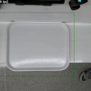

# AI City Challenge

[Website](https://www.aicitychallenge.org){: .btn .fs-3 .mb-4 .mb-md-0 }

  
Table of contents

  {: .text-delta }
  1. TOC
  {:toc}

---

Transportation is one of the largest segments that can benefit from actionable 
insights derived from data captured by sensors. Between traffic, signaling
systems, transportation systems, infrastructure, and transit, the opportunity
for insights from these sensors to make transportation systems smarter is
immense. Unfortunately, there are several reasons why these potential benefits
have not yet materialized. Poor data quality, the lack of labels for the data,
and the lack of high-quality models that can convert the data into actionable
insights are some of the biggest impediments to unlocking the value of the data.
There is a need for platforms that allow for appropriate analysis from edge to
cloud, which will accelerate the development and deployment of these models.

## Contests

### [AIC21](https://www.aicitychallenge.org/2021-ai-city/)

|                                                                                                                                                                                                |  |  |
|:--------------------------------------------------------------------------------------------------------------------------------------------------------------------------------------------------------------:|:----------------:|:----------------:|
|    [**Track 1:  Vehicle Counting**](https://phlong3105.github.io/one/challenges/aic/aic21_track1) |                  |                  |

### [AIC22](https://www.aicitychallenge.org/)

|                                                                                                                                                                                               |                                                                                                                                                                                     |                                                                                                                                                                                       |
|:-------------------------------------------------------------------------------------------------------------------------------------------------------------------------------------------------------------:|:---------------------------------------------------------------------------------------------------------------------------------------------------------------------------------------------------:|:-----------------------------------------------------------------------------------------------------------------------------------------------------------------------------------------------------:|
|             [**Track 1:  MTMC**](https://phlong3105.github.io/one/challenges/aic/aic22_track1)          |    [**Track 2:  NL Retrieval**](https://phlong3105.github.io/one/challenges/aic/aic22_track2) |    [**Track 3:  Driving Action**](https://phlong3105.github.io/one/challenges/aic/aic22_track3) |
|    [**Track 4:  Retail Checkout**](https://phlong3105.github.io/one/challenges/aic/aic22_track4) |
