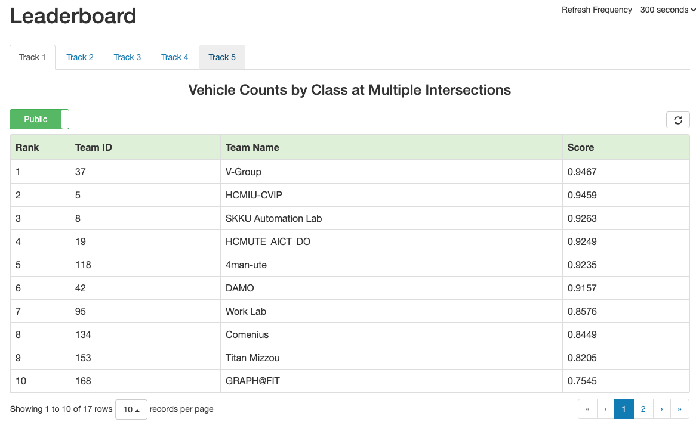

<div align="center">


AIC21 Track 1: Multi-Class Multi-Movement Vehicle Counting Using IoT Devices
=============================
<a href="https://www.aicitychallenge.org/2021-challenge-tracks/"></a>
</div>

<div align="justify">

Participating teams will count four-wheel vehicles and freight trucks that
follow pre-defined movements from multiple camera scenes. For example, teams
will perform vehicle counting separately for left-turning, right-turning and
through traffic at a given intersection approach. This helps traffic engineers
understand the traffic demand and freight ratio on individual corridors, which
can be used to design better intersection signal timing plans and apply other
traffic congestion mitigation strategies when necessary. To maximize the
practical value of the outcome from this track, both vehicle counting
effectiveness and the program execution efficiency will contribute to the final
score for each participating team. Additionally, mimicking the results of
in-road hardware sensor-based counting systems, solutions to this problem are
expected to run online in real-time. While any system can be used to generate
solutions to the problem for general submissions, the final evaluation of the
top methods will be executed using an IoT device. The team with the highest
combined efficiency and effectiveness score will be declared the winner of this
track.

## Important Dates

<details><summary>Details:</summary>

- **Challenge kick-off**: 01/12/2021


- **Data sets shared with participants**: 01/22/2021


- **Evaluation server open to submissions**: 03/06/2021


- **Challenge track submissions due**: 04/09/2021 (11:59 PM, Pacific Time)
  - _Evaluation submission is closed and rankings are finalized._


- **Workshop papers due**: 04/13//2021 (09:00 AM, Pacific Time)
	- _Since our review is not double-blind, papers should be submitted in
	  final/camera-ready form._


- **Final decisions to authors**: 04/18/2021
  - _All authors are notified in CMT. There are about 24 hours to prepare for
	the final version of accepted papers._


- **Final papers due**: 04/19/2021 (11:59 PM, Pacific Time)
  - _All camera ready paper should be uploaded to CMT to be published by 
    CVPR 2021. The accepted workshop papers will be accessible online at IEEE 
    Xplore Digital Library and CVF Open Access._


- **Open source on GitHub (training code + testing code + additional annotation)
  due**: 05/09/2021 (11:59 PM, Pacific Time)
	- _All the competitors/candidates for awards MUST release their code for
	  validation before decision of awardees. The performance on the leaderboard
	  has to be reproducible without the use of external data._


- **Presentation of papers and announcement of awards**: 06/25/2021 (02:00 PM,
  Pacific Time)

</details>

## Data and Evaluation

<details><summary><b>Data:</b></summary>

The data set contains 31 video clips (about 9 hours in total) captured from 20
unique camera views (some cameras provide multiple video clips to cover
different lighting and weather conditions.). Each camera view comes with a
detailed instruction document describing the region of interest (ROI), movements
of interest (MOI) and how vehicles should be counted (please refer to the
`ReadMe.txt` file for more details). The instruction document is meant to remove
the ambiguities so that different people manually counting vehicles following
instruction in the document should yield the same result. The ground truth
counts for all videos are manually created and cross-validated following the
provided instruction document.

The 9 hours of video in track 1 are split into two data sets A and B. Data set
A (5 hours in total) along with all the corresponding instruction documents and
a small subset of ground truth labels (for demonstration purpose) are made
available to participating teams. Data set B will be reserved for later testing.
</details>

<details><summary><b>Tasks:</b></summary>

A crucial tool in signal timing planning is capturing accurate movement- and
class-specific vehicle counts. To be useful in online intelligent transportation
systems, methods designed for this task must not only be accurate in their
counting, but should also be efficient, preferably working in real-time on the
edge [7]. Teams should thus design online real-time programs to count both cars
and trucks belonging to the MOIs given a video clip. In this track, both the
effectiveness of the program and its efficiency will count towards determining
the winning team.

Teams can design their vehicle counting programs and submit counting results of
data set A to the online evaluation system to get ranked on the public leader
board. The public leader board only provides a way for a team to evaluate and
improve their systems and the ranking will NOT determine the winners of this
track. All prize contenders have to submit functioning code to be tested on data
set B. The best performer on data set B combining both the counting accuracy and
the program efficiency will be declared the winner.

The Track 1 program should be able to accept input data in a streaming fashion
and provide its results also in a streaming fashion via standard output. Output
data should be formatted as detailed above and any other information should be
directed to standard error rather than standard output. In particular, the
program should open any input video as a stream (e.g., using cv2.VideoCapture)
and start producing counts output within 15 seconds from the start of its
execution. At any given time $t$, assuming the program execution start as $t_0$, 
any output for video frames outside the range $[\max(t_0, t-15s), t]$ will be 
ignored in the online evaluation.
</details>

<details><summary><b>Submission Format:</b></summary>

To be ranked on the public leader board of data set A, one text file should be
submitted to the online evaluation system containing, on each line, details of
one counted vehicle, in the following format (values are space-delimited):

```text
<gen_time> <video_id> <frame_id> <movement_id> <vehicle_class_id>
```

Where:

- `<gen_time>` is the generation time, i.e., the time from the start of the
  program execution until this frame’s output is generated, in seconds. Teams
  should obtain a unix timestamp at the start of the program execution and
  before each output to the stream and report the differences between the
  current unix timestamp and the program execution start unix timestamp.
- `<video_id>` is the video numeric identifier, starting with 1. It represents
  the position of the video in the list of all track videos, sorted in
  alphanumeric order.
- `<frame_id>` represents the frame count for the current frame in the current
  video, starting with 1.
- `<movement_id>` denotes the movement numeric identifier, starting with 1. It
  represents the position of the movement in the list of the MOIs defined in the
  corresponding instruction document of that video.
- `<vehicle_class_id>` is the vehicle classic numeric identifier. Only two
  values are accepted {1, 2} where 1 stands for “car” and 2 represents “truck”.
</details>

<details><summary><b>Evaluation:</b></summary>

The Track 1 evaluation score ($S1$) is a weighted combination between the 
Track 1 efficiency score ($S1_{efficiency}$) and the Track 1 effectiveness 
score ($S1_{effectiveness}$).
$$ S1 = \alpha S1_{efficiency} + \beta S1_{effectiveness} $$
$$ where, \ \alpha=0.3, \ \beta=0.7 $$

The $S1_{efficiency}$ score is based on the total Execution Time provided by the
contestant, adjusted by the Efficiency Base factor, and normalized within the
range [0, 1.1x video play-back time].

$$ S1_{efficiency} = \max(0, 1 - \frac{time \times base \textunderscore factor}{1.1 \times video \textunderscore total \textunderscore time}) $$

</details>

## Results

<div align="center">
	
	<p>Leaderboard of the 1st round.</p>
</div>

## Publications

| Status | Method | Team ID | Rank | Architecture | Date | Publication |
|:------:|--------|:-------:|:----:|--------------|------|-------------|
|        |        |         |      |              |      |             |

</div>
