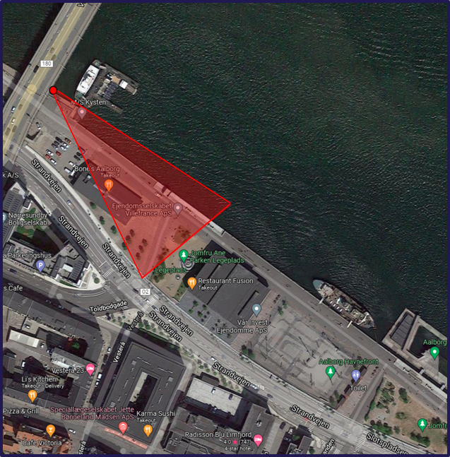
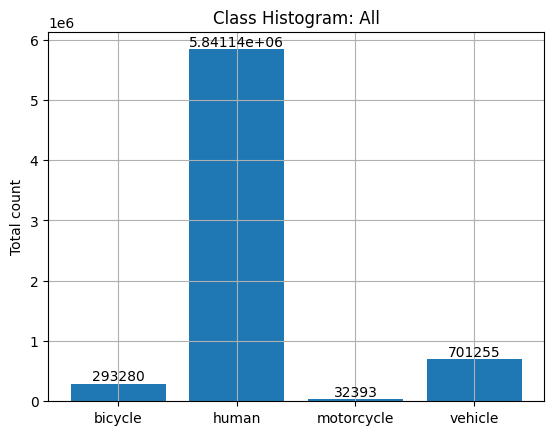
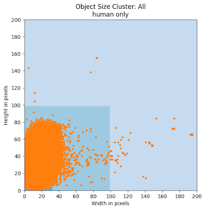
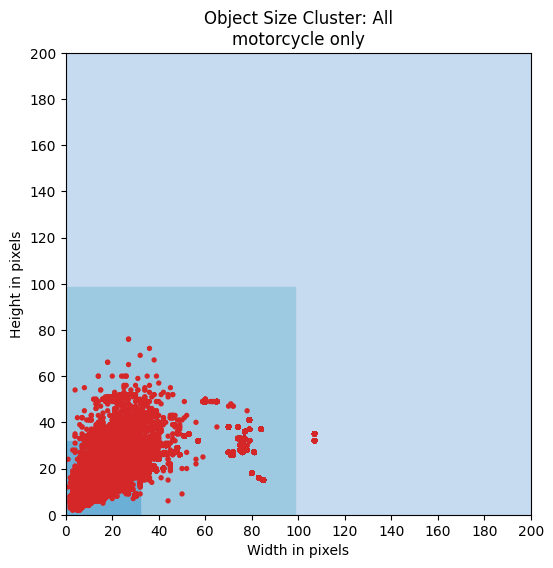
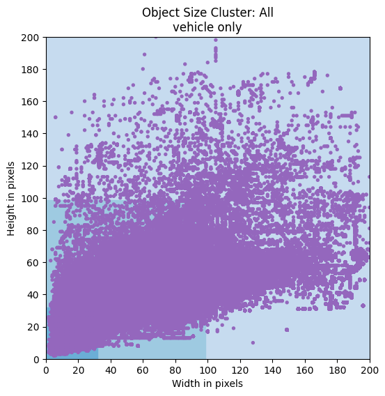

<div align="center">


2022 Seasons in Drift Challenge at ECCV
=============================
<a href="https://chalearnlap.cvc.uab.cat/challenge/51/description/"></a>
</div>

<div align="justify">

The challenge will use an extension of the LTD Dataset [1] which consists of
thermal footage that spans multiple seasons. For deployment and long-term use of
machine-learning algorithms in a surveillance context it is vital that the
algorithm is robust to the concept drift that occurs as the conditions in the
outdoor environment changes. This challenge aims to spotlight the problem of
concept drift in a surveillance context and highlight the challenges and
limitations of existing methods. To provide a direction of research for the
future.

## Important Dates

<details><summary>Details:</summary>

- **04/25/2022 Start of challenge**
	- Release of training- and validation- data (with and without ground truth
	  respectively).


- **06/15/2022 Release of test data (without ground truth) and validation
  labels**
	- Release of test data (without ground truth) and validation labels. At this
	  stage the participants can download an encrypted version of the test-data
	  and validation labels a few days ahead of the release of the decryption
	  key, to ensure that participants regardless of internet connectivity are
	  on an equal footing.


- **06/17/2022 Start of test phase (end of development phase)**
	- Release of the decryption key for test data and validation labels.
	  Participants start predicting the results on the test data. At this stage
	  they can retrain (or fine-tune) their models with the additional
	  validation set.


- **06/24/2022 End of the Challenge**
	- Deadline for submitting the final predictions over the test (evaluation)
	  data.


- **06/26/2022 Code and fact sheets submission**
	- Deadline for Code submission with detailed instructions (known as "code
	  verification stage"). This includes a list of requirements, pretrained
	  models, and so on. Note, training code with instructions is also required.
	  Organizers strongly encourage the use of docker to facilitate
	  reproducibility.
	- In addition to the code, participants are requested to submit the fact
	  sheets using a template (TBD) provided by the organizers.
	- Additional details about code and fact sheets submission are provided in
	  our challenge webpage, winning solutions (Post challenge) section.


- **07/07/2022 Release of final results**

We encourage participants to submit a paper to the associated workshop,
independently of their rank position.

- Paper submission: – July 1st, 2022
- Paper submission for challenge participants: – July 5th, 2022
- Decision notification: – July 10th, 2022
- Camera ready: – July 15th, 2022

</details>

## Contest Details

<details><summary><b style="font-size:17px">Data:</b></summary>

The LTD dataset used in the Seasons in Drift Challenge at ECCV'22 is an
extension of an existing concept drift dataset and spans 188 days in the period
of 14th May 2020 to 30th of April 2021, with a total of 1689 2-minute clips
sampled at 1fps with associated bounding box annotations for 4 classes (Human,
Bicycle, Motorcycle, Vehicle). The collection of this dataset has included data
from all hours of the day in a wide array of weather conditions overlooking the
harborfront of Aalborg, Denmark. In this dataset depicts the drastic changes of
appearance of the objects of interest as well as the scene over time in a static
surveillance context to develop robust algorithms for real-world deployment.

<div align="center">
	
	<p>Camera setup</p>
</div>

```text
######### Object Size Grouping Scheme #########
Small (<1024 pixels)
Medium (1025-9695 pixels)
Large (>9696 pixels)

############### Subset Overview ###############
Subset name   :  Full-All
Clips         :  1689
Different days:  188
Timespan      :  2020-05-14 - 2021-04-30
-------------- Object Presence ----------------
Empty frames  : 844638 (78.9937217499792 %)
Frames /w obj : 224609 (21.00627825002081 %)
Total frames  : 1069247

########### Object Distributions ##############
All*          : 6868067
bicycle       : 293280
human         : 5841139
motorcycle    : 32393
vehicle       : 701255
Unique Objects: 143294
------------------- Small ---------------------
All*          : 6092590
bicycle       : 288081
human         : 5663804
motorcycle    : 27153
vehicle       : 113552
------------------- Medium --------------------
All*          : 37468
bicycle       : 7
human         : 454
vehicle       : 37007
------------------- Large ---------------------
All*          : 738009
bicycle       : 5192
human         : 176881
motorcycle    : 5240
vehicle       : 550696
###############################################
```

<div align="center">
	
	
	
	
	
</div>

</details>

<details><summary><b style="font-size:17px">Tasks:</b></summary>

This challenge is split into **3 different tracks** associated with thermal
object detection. Each track will have the same evaluation criteria/data but
will vary with both the amount of data as well as the time span of the data. The
training data is chosen by selecting the coldest day, and surrounding data as
cold environments introduce the least amount of concept drift. Each track aims
at evaluating how robust a given detection method is to concept drift, by
training on limited data from a specific time period (day, week, month in
February) and evaluation performance across time, by validating and testing
performance on months of unseen data (Jan., May., Apr., May., Jun., Jul., Aug.
and Sep.).

</details>

<details><summary><b style="font-size:17px">Submission Format:</b></summary>

</details>

<details><summary><b style="font-size:17px">Evaluation:</b></summary>

We follow the COCO evaluation scheme for mAP. The primary metric is, mAP across
10 different IoU thresholds (ranging from 0.5 to .95 at 0.05 increments). This
is calculated for each month in the validation/test set and the model is then
ranked based on a weighted average of each month (more distant months having a
larger weight as more concept drift is present). The evaluation is performed
leveraging the official COCO evaluation tools
</details>

## Results

<div align="center">
	
	<p>Leaderboard of the 1st round.</p>
</div>

## Publications

| Status | Method | Team ID | Rank | Architecture | Date | Publication |
|:------:|--------|:-------:|:----:|--------------|------|-------------|
|        |        |         |      |              |      |             |

</div>
