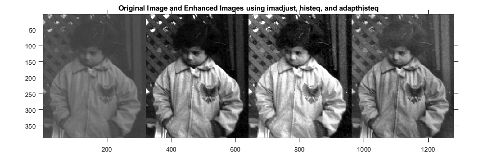

   </a>

Image Enhancement
=============================

- Image enhancement is the procedure of improving the quality and the information content of original data before processing.
- In the new era of deep learning, deep image enhancement models can perform a variety of tasks such as low-light enhancement, de-rain, de-snow, de-haze, etc.

## Methods

| Status | Method                      | Learning Type | Task                                    | Date       | Publication           |
|:------:|-----------------------------|---------------|-----------------------------------------|------------|-----------------------|
|   🟩   | [**Zero-DCE**](zero_dce.md) | Deep Learning | `Low-light`                             | 2020/06/19 | CVPR 2002, TPAMI 2021 |
|   🟩   | **MRPNet**                  | Deep Learning | `Derain`, `Desnow`, `Dehaze`, `Denoise` | 2021/06/25 | CVPR 2021             |
|   🟩   | **HINet**                   | Deep Learning | `Derain`, `Deblur`, `Denoise`           | 2021/06/25 | CVPR 2021             |

## Data
