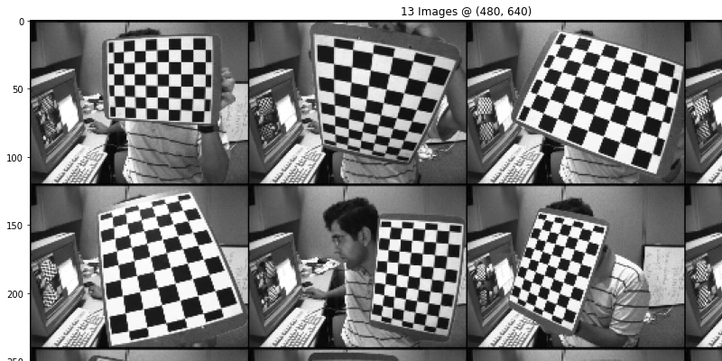

Camera Calibration
=============================

Camera calibration (also known as camera resectioning) is the process of
estimating intrinsic and/or extrinsic parameters.

- **Extrinsic** parameters describe its position and orientation in the world.
- **Intrinsic** parameters deal with the camera's internal characteristics,
  such as, its focal length, skew, distortion, and image center.

Knowing intrinsic parameters is an essential first step for 3D computer
vision, as it allows you to estimate the scene's structure in Euclidean space
and removes lens distortion, which degrades accuracy.

## Methods

| Status | Method                                           | Architecture | Date       | Publication                    |
|:------:|--------------------------------------------------|--------------|------------|--------------------------------|
|   ✅    | [**Camera&nbsp;Parameter**](camera_parameter.md) |              | 2022/03/01 | Towards&nbsp;Data&nbsp;Science |

