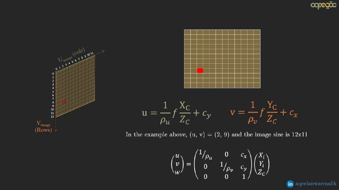
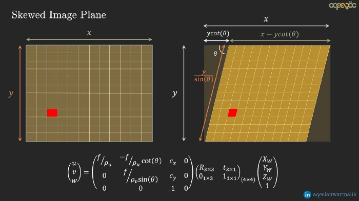
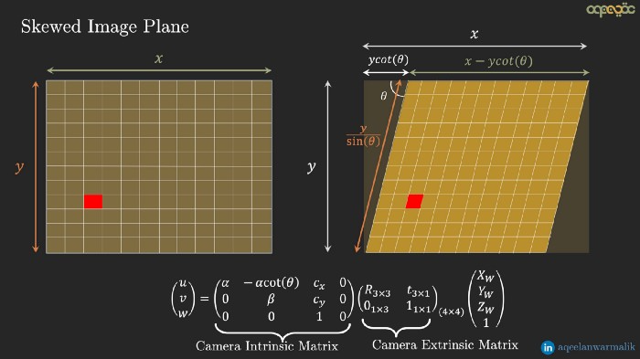

 

# What are Intrinsic and Extrinsic Camera Parameters in Computer Vision?

{: .btn .fs-3 .mb-4 .mb-md-0 }

  
Table of contents

  {: .text-delta }
  1. TOC
  {:toc}

---

## Highlight

Cameras are the sensors used to capture images. They take the points in the
world and project them onto a 2D plane which we see as images.

The complete transformation is usually divided into two parts: **Extrinsic**
and **Intrinsic**.

- The extrinsic parameters depend on its location and orientation and have
  nothing to do with its internal parameters such as focal length, the field of
  view, etc.
- The intrinsic parameters of a camera depend on how it captures the images.
  Parameters such as focal length, aperture, field-of-view, resolution, etc.
  govern the intrinsic matrix of a camera model.

## Method

Extrinsic and extrinsic parameters are transformation matrices that convert
points from one coordinate system to the other. In order to understand these
transformations, we first need to understand **4 different coordinate systems**.

### 1. World Coordinate System (3D)

|  |
|:---------------------------------------------------------------------:|
|                *A 3D point in world coordinate system*                |
|                                                       | 

**$[X_w, Y_w, Z_w]$**: It is a 3D basic cartesian coordinate system with 
arbitrary origin.

For example a specific corner of the room. A point in this coordinate system
can be denoted as $P_w = (X_w, Y_w, Z_w)$.

### 2. Object/Camera Coordinate System (3D)

|  |
|:-----------------------------------------------------------------------:|
|    |
|                *A 3D point in camera coordinate system*                 |
|                                                         | 

**$[X_c, Y_c, Z_c]$**: It's the coordinate system that measures relative to the
object/camera’s origin/orientation.

The z-axis of the camera coordinate system usually faces outward or inward to
the camera lens (camera principal axis) as shown in the image above (z-axis
facing inward to the camera lens).

One can go from the world coordinate system to object coordinate system
(and vice-versa) by Rotation and Translation operations.

- The $4 \times 4$ transformation matrix that converts points from the world
  coordinate system to the camera coordinate system is known as the camera
  extrinsic matrix.
- The camera extrinsic matrix changes if the physical location/orientation of
  the camera is changed (for example camera on a moving car).

### 3. Image Coordinate System (2D) [Pinhole Model]

|  |
|:---------------------------------------------------------------------:|
|              |
|              |
|              |
|              |
|                *A 2D point in image coordinate system*                |
|                                                       |

**$[X_i, Y_i]$**: A 2D coordinate system that has the 3D points in the camera
coordinate system projected onto a 2D plane (usually normal to the z-axis of
the camera coordinate system — shown as a yellow plane in the figures below) of
a camera with a Pinhole Model.

- The rays pass the center of the camera opening and are projected on the 2D
  plane on the other end.
- The 2D plane is what is captured as images by the camera.
- It is a lossy transformation, which means projecting the points from the
  camera coordinate system to the 2D plane can not be reversed (the depth
  information is lost — Hence by looking at an image captured by a camera, we
  can’t tell the actual depth of the points).
- The $X$ and $Y$ coordinates of the points are projected onto the 2D plane.
- The 2D plane is at $f$ (focal-length) distance away from the camera.
- The projection $X_i$, $Y_i$ can be found by the law of similar triangles (the
  ray entering and leaving the camera center has the same angle with the x and
  y-axis, alpha and beta respectively).

Hence, in the matrix form, we have the following transformation matrix from the
camera coordinate system to the image coordinate system. This transformation
(from camera to image coordinate system) is the first part of the camera
intrinsic matrix.

### 4. Pixel Coordinate System (2D)

|  |
|:---------------------------------------------------------------------------:|
|                   *A 2D point in pixel coordinate system*                   |
|                                                             |

**$[u, v]$**: This represents the integer values by discretizing the points in 
the image coordinate system.

Pixel coordinates of an image are discrete values within a range that can be
achieved by dividing the image coordinates by pixel width and height
(parameters of the camera — units: meter/pixel).

The pixel coordinates system has the origin at the left-top corner, hence a
translation operator $(c_x, c_y)$ is also required alongside the discretization.

|  |
|:---------------------------------------------------------------------------:|
|                                                             |

The complete transformation from the image coordinate system to pixel
coordinate system can be shown in the matrix form as below.

|  |
|:---------------------------------------------------------------------------:|
|                                                             |

Sometimes, the 2D image plane is not a rectangle but rather is skewed i.e. the
angle between the X and Y axis is not 90 degrees.

In this case, another transformation needs to be carried out to go from the
rectangular plane to the skewed plane (before carrying out the transformation
from image to pixel coordinate system).

If the angle between the x and y-axis is theta, then the transformation that
converts points from the ideal rectangular plane to the skewed plane can be
found as below

|  |
|:---------------------------------------------------------------------------:|
|                                                             |

These two transformation matrices i.e. **transformation from rectangular image
coordinate system to skewed image coordinate system and skewed image coordinate
system to pixel coordinate system** forms the second part of the
**camera intrinsic matrix**.

Combining the three transformation matrices yields the camera extrinsic matrix
as shown below

|  |
|:---------------------------------------------------------------------------:|
|  |
|  |
|                                                             |

### Summary

The extrinsic matrix is a transformation matrix from the world coordinate
system to the camera coordinate system, while the intrinsic matrix is a
transformation matrix that converts points from the camera coordinate system to
the pixel coordinate system.

- **World-to-Camera**: 3D-3D projection. Rotation, Scaling, Translation
- **Camera-to-Image**: 3D-2D projection. Loss of information. Depends on the
  camera model and its parameters (pinhole, f-theta, etc)
- **Image-to-Pixel**: 2D-2D projection. Continuous to discrete. Quantization
  and origin shift.
