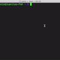

---

# One Research Framework

`One` is a comprehensive research framework and knowledge base of our works 
related to computer vision, machine learning, and deep learning.

[Getting Started](#getting-started){: .btn .btn-primary .fs-5 .mb-4 .mb-md-0.mr-2 } 
[Knowledge Base](#knowledge-base){: .btn .fs-5 .mb-4 .mb-md-0 } 
[Cite](#cite){: .btn .fs-5 .mb-4 .mb-md-0 } 
[Contact](#contact){: .btn .fs-5 .mb-4 .mb-md-0 } 

---

## Getting Started

### Prerequisite

|            | Requirements                                                                                                                                                                                                                                         |
|:-----------|:-----------------------------------------------------------------------------------------------------------------------------------------------------------------------------------------------------------------------------------------------------|
| **OS**     | [**Ubuntu 20.04 / 22.04**](https://ubuntu.com/download/desktop) (fully supports), `Windows 10` and `MacOS` (partially supports)                                                                                                                      |
| **Env**    | [**Python>=3.9.0**](https://www.python.org/), [**PyTorch>=1.11.0**](https://pytorch.org/get-started/locally/), [**cudatoolkit=11.3**](https://pytorch.org/get-started/locally/), with [**anaconda**](https://www.anaconda.com/products/distribution) |	
| **Editor** | [**PyCharm**](https://www.jetbrains.com/pycharm/download)                                                                                                                                                                                            |

### Directory

```text
one               # root directory
 |__ data         # contains data
 |__ docs
 |__ install      # helpful installation scripts       
 |__ pretrained   # pretrained models weights
 |__ scripts      # main scripts
 |__ src
 |      |__ one
 |      |__ project1
 |      |__ project2
 |      |__ ..
 |__ tests
 |__ third_party
```

### Installation using `conda`

```shell
cd <to-where-you-want-to-save-one-dir>
mkdir -p one
mkdir -p one/data
cd one

# Install `aic22_track4` package
git clone git@github.com:phlong3105/one
cd one/install
chmod +x install.sh
conda init bash

# Install package. When prompt to input the dataset directory path, you should 
# enter: <some-path>/one/datasets
bash -i install.sh
cd ..
pip install --upgrade -e .
```

## Knowledge Base

### Tools

|                                                                                                                                                    |                                                                                                                                          |                                                                                                                                     |
|:------------------------------------------------------------------------------------------------------------------------------------------------------------------:|:--------------------------------------------------------------------------------------------------------------------------------------------------------:|:---------------------------------------------------------------------------------------------------------------------------------------------------:|
| [](https://phlong3105.github.io/one/tools/anaconda) <br> [**Anaconda**](https://phlong3105.github.io/one/tools/anaconda) | [](https://phlong3105.github.io/one/tools/docker) <br> [**Docker**](https://phlong3105.github.io/one/tools/docker) | [](https://phlong3105.github.io/one/tools/swift) <br> [**Swift**](https://phlong3105.github.io/one/tools/swift) |
|      [](https://phlong3105.github.io/one/tools/python) <br> [**Python**](https://phlong3105.github.io/one/tools/python)      |                                                                                                                                                          |                                                                                                                                                     |


## Cite

If you find our work useful, please cite the following:

```text
@misc{Pham2022,  
    author       = {Long Hoang Pham},  
    title        = {One: One Research Framework},  
    publisher    = {GitHub},
    journal      = {GitHub repository},
    howpublished = {\url{https://github.com/phlong3105/one}},
    year         = {2022},
}
```

## Contact

If you have any questions, feel free to contact `Long Pham` 
([longpham3105@gmail](longpham3105@gmail) or [phlong@skku.edu](phlong@skku.edu))
