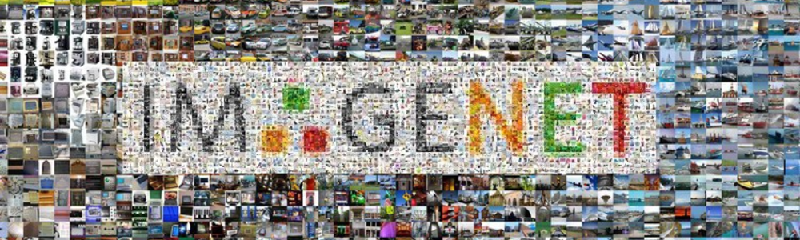

Image Classification (Backbone)
=============================

## Overview

Image Classification (often referred to as Image Recognition) is the task of
associating one (single-label classification) or more (multi-label
classification) labels to a given image.

## Methods

| Status | Method                  | Architecture | Date       | Publication     |
|:------:|-------------------------|--------------|------------|-----------------|
|   ✅    | [**CSPNet**](cspnet.md) | Deep         | 2020/06/25 | CVPRW&nbsp;2020 |
