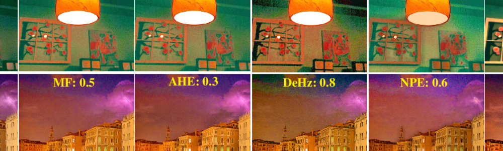

# Image Enhancement

  
Table of contents

  {: .text-delta }
  1. TOC
  {:toc}

---

Image enhancement is the procedure of improving the quality and the
information content of original data before processing.

In the new era of deep learning, deep image enhancement models can perform a
variety of tasks such as low-light enhancement, de-rain, de-snow, de-haze, etc.

## Methods

| Status | Method                      | Architecture | Task                            | Date       | Publication                     |
|:------:|-----------------------------|--------------|---------------------------------|------------|---------------------------------|
|   ✅    | [**Zero-DCE**](zero_dce.md) | Deep         | Low-light                       | 2020/06/19 | CVPR&nbsp;2020, TPAMI&nbsp;2021 |
|   ✅    | **MRPNet**                  | Deep         | Derain, Desnow, Dehaze, Denoise | 2021/06/25 | CVPR&nbsp;2021                  |
|   ✅    | [**HINet**](hinet.md)       | Deep         | Derain, Deblur, Denoise         | 2021/06/25 | CVPR&nbsp;2021                  |
