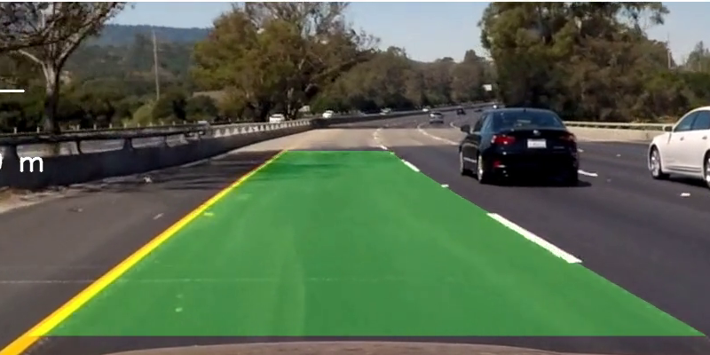

Lane Detection
=============================

Lane detection is the task of detecting lanes on a road from a camera. Here is a
demo of lane detection in autonomous vehicle:

	

## Methods

| Status | Method                                                    | Architecture | Date       | Publication |
|:------:|-----------------------------------------------------------|--------------|------------|-------------|
|   ✅    | [**Advanced Lane Detection**](advanced_lane_detection.md) | Non-deep     | 2020/01/10 | GitHub      |
