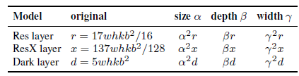
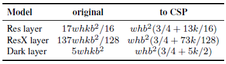
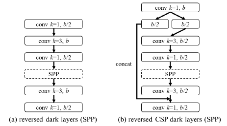
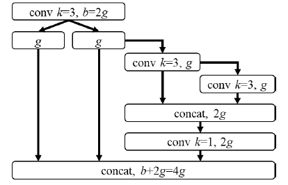

<div align="center">

Scaled-YOLOv4: Scaling Cross Stage Partial Network
=============================
Chien-Yao Wang, Alexey Bochkovskiy, and Hong-Yuan Mark Liao

CVPR 2021

<a href="data/scaled_yolov4.pdf"></a>
<a href="https://github.com/WongKinYiu/ScaledYOLOv4"></a>
<a href="https://sh-tsang.medium.com/review-scaled-yolov4-scaling-cross-stage-partial-network-51e3c515b0a7"></a>
<a href="https://alexeyab84.medium.com/scaled-yolo-v4-is-the-best-neural-network-for-object-detection-on-ms-coco-dataset-39dfa22fa982#:~:text=yolov4%2Dcsp.cfg-,Scaled%20YOLO%20v4%20is%20the%20best%20neural%20network%20for%20object,15%20FPS%20to%201774%20FPS."></a>
</div>

<div align="justify">

## Highlight

First, YOLOv4 is re-designed to form YOLOv4-CSP.

Then, a network scaling approach that modifies not only the depth, width,
resolution, but also structure of the network, which finally forms
Scaled-YOLOv4.

<div align="center">
	
	<p>Chart of Accuracy (vertical axis) and Latency (horizontal axis) on a Tesla V100 GPU (Volta) with batch = 1 without using TensorRT.</p>
</div>

## Method

In Scaled-YOLOv4, there are many prior arts used, e.g.
[CSPNet](../image_classification/cspnet.md), OSANet, YOLOv4. It is better to
know them before Scaled-YOLOv4.

### 1. Principle of Model Scaling

<details open>
<summary><b style="font-size:16px">General Principle of Model Scaling</b></summary>

<div align="center">
	
	<p>FLOPs of different computational layers with different model scaling factors.</p>
</div>

Let the scaling factors that can be used to adjust the image size, the number
of layers, and the number of channels be **_α_**, **_β_**, and **_γ_**,
respectively. For the k-layer CNNs with _b_ base layer channels, when these
scaling factors
vary, the corresponding changes on FLOPs are shown as above table.

> **The scaling size, depth and width cause increase in the computation cost**.
> They respectively show square, linear, and square increase.

<div align="center">
	
	<p>FLOPs of different computational layers with/without CSP-ization.</p>
</div>

- [CSPNet](../image_classification/cspnet.md) is applied to ResNet, ResNeXt,
  and Darknet, the changes in the amount of computations are observed in the
  below
  table.
- In brief, [CSPNet](../image_classification/cspnet.md) splits the input into
  two paths. One performs convolutions. One performs no convolution. They are
  fused at the output.
- **[CSPNet](../image_classification/cspnet.md) can effectively reduce the
  amount of computations (FLOPs)** on ResNet, ResNeXt, and Darknet by 23.5%,
  46.7%, and 50.0%, respectively.

> Therefore, CSP-ized models are used as the best model for performing model
> scaling.
</details>

<details open>
<summary><b style="font-size:16px">Scaling Tiny Models for Low-End Devices</b></summary>

<div align="center">
	
	<p>Dense layer in DenseNet & OSA layer in VoVNet/OSANet.</p>
</div>
<div align="center">
	
	<p>Dense layer in DenseNet & OSA layer in VoVNet/OSANet.</p>
</div>

- Memory bandwidth, memory access cost (MACs), and DRAM traffic should also be
  considered.
- **Lightweight models** are different from large models in that their
  **parameter utilization efficiency must be higher**.
- The network with efficient parameter utilization is analyzed, such as the
  computation load of DenseNet and OSANet, where _d_ means growth rate.

> The tiny model is designed with the help of OSANet, which has a smaller
> computation complexity.

<div align="center">
	
	<p>Number of channel of OSANet, CSPOSANet, and CSPOSANet with partial in 
    computational block (PCB).</p>
</div>

- A new concept of gradient truncation is performed between computational block
  of the CSPOSANet.
- This feature is to **re-plan the _b_ channels of the base layer and the *kg*
  channels generated by computational block, and split them into two paths with
  equal channel numbers**, as shown above.
- When the number of channel is _b+kg_, these channels are split into 2 paths.

> The CSPOSANet is designed to **dynamically adjust the channel allocation**.

<div align="center">
	
	<p>The CIO of OSA, CSP, and the designed CSPOSANet.</p>
</div>
- Minimize Convolutional Input/Output (CIO) is an indicator that can measure
the status of DRAM IO.

> When kg>b/2, **the proposed CSPOSANet can obtain the best CIO**.

</details>

<details open>
<summary><b style="font-size:16px">Scaling Large Models for High-End GPUs</b></summary>

<div align="center">
	
	<p>Model scaling factors of different parts of object detectors.</p>
</div>

- We hope to improve the accuracy and maintain the real-time inference speed
  after scaling up the CNN model, the above factors should be considered.
- The biggest difference between image classification and object detection is
  that the former only needs to identify the category of the largest component
  in an image, while the latter needs to predict the position and size of each
  object in an image.

> **The ability to better predict the size of an object basically depends on the
receptive field of the feature vector.**

<div align="center">
	
	<p>Effect of receptive field caused by different model scaling factors.</p>
</div>

- It is apparent that width scaling can be independently operated.
- The compound of {size^input, #stage} turns out with the best impact.

> Therefore, when performing scaling up, **compound scaling is firstly performed
on size^input, #stage**, and then according to real-time requirements, **scaling
is further performed on depth and width respectively**.

</details>

### 2. Scaled-YOLOv4: CSP-ized YOLOv4 / YOLOv4-CSP

<details open>
<summary><b style="font-size:16px">Backbone</b></summary>

The amount of computation of each CSPDarknet stage is _whb²(9/4 + 3/4 + 5k/2)_.

According to the previous section, CSPDarknet stage will have a better
computational advantage over Darknet stage only when _k>1_ is satisfied.

The number of residual layer owned by each stage in CSPDarknet53 is 1–2–8–8–4
respectively.

In order to get a better speed/accuracy trade-off, the first CSP stage is
converted into original Darknet residual layer.
</details>

<details open>
<summary><b style="font-size:16px">Neck</b></summary>

<div align="center">
	
	<p>Computational blocks of reversed Dark layer (SPP) and reversed CSP dark 
	layers (SPP).</p>
</div>

The PAN architecture in YOLOv4 is also CSP-ized as above. This new update
effectively cuts down 40% of computation.
</details>

<details open>
<summary><b style="font-size:16px">SPP</b></summary>

Also, SPP module (SPPNet) is now inserted in the middle position of the first
computation list group of the CSPPAN.
</details>

### 3. Scaled-YOLOv4: YOLOv4-tiny

<div align="center">
	
	<p>Computational block of YOLOv4-tiny.</p>
</div>

YOLOv4-tiny is designed for low-end GPU device. **The CSPOSANet with partial
in computational block (PCB) architecture** is used to form the backbone of
YOLOv4.

- _g=b=2_ is set as the growth rate and make it grow to _b/2+kg=2b_ at the end.
- Through calculation, _k=3_ is deduced, and its architecture is shown as above.

### 4. Scaled-YOLOv4: YOLOv4-large

<div align="center">
	
	<p>Computational block of YOLOv4-tiny.</p>
</div>

YOLOv4-large is designed for cloud GPU. A fully CSP-ized model **YOLOv4-P5**
is designed and can be scaled up to **YOLOv4-P6** and **YOLOv4-P7**.

- Compound scaling on size^input, #stage is performed.
- The depth scale of each stage to _2^(d_si)_, and _d_s_ to
  [1, 3, 15, 15, 7, 7, 7].
- The inference time is further used as constraint to perform additional width
  scaling.
- **YOLOv4-P6** can reach real-time performance at **30 FPS** video when the
  **width scaling factor is equal to 1**.
- **YOLOv4-P7** can reach real-time performance at **16 FPS** video when the
  **width scaling factor is equal to 1.25**.

## Ablation Studies

<details open>
<summary><b style="font-size:16px">CSP-ized Model</b></summary>

<div align="center">
	
	<p>Ablation study of CSP-ized models @ 608x608.</p>
</div>

- Darknet53 (D53) is used as backbone and FPN with SPP (FPNSPP) and PAN with
  SPP (PANSPP) are chosen as necks to design ablation studies.
- LeakyReLU (Leaky) and Mish activation function are tried.

> **CSP-ized models have greatly reduced the amount of parameters and
> computations by 32%, and brought improvements in both Batch 8 throughput and
> AP.**
>
> Both **CD53s-CFPNSPP-Mish, and CD53s-CPANSPP-Leaky** have the same batch 8
> throughput with D53-FPNSPP-Leaky, but they respectively **have 1% and 1.6% AP
> improvement with lower computing resources**.
>
> Therefore, **CD53s-CPANSPP-Mish is decided to used**, as it results in the
> highest AP in the above table as the backbone of YOLOv4-CSP.
</details>

<details open>
<summary><b style="font-size:16px">YOLOv4-tiny</b></summary>

<div align="center">
	
	<p>Ablation study of partial at different position in computational block.</p>
</div>

The designed PCB technique can make the model more flexible, because such a
design can be adjusted according to actual needs. The proposed COSA can get a
higher AP.

> Therefore, **COSA-2x2x is finally chosen**, which received the **best
> speed/accuracy trade-off** in the experiment as the **YOLOv4-tiny**
> architecture.
</details>

<details open>
<summary><b style="font-size:16px">YOLOv4-large</b></summary>

<div align="center">
	
	<p>Ablation study of training schedule with/without fine-tuning.</p>
</div>

For YOLOv4-large, 300 epochs are firstly executed and then followed by 150
epochs for fine-tuning using stronger data augmentation method.

> **AP is improved with further fine-tuning using stronger data augmentation
> method**.
</details>

## Results

<details open>
<summary><b style="font-size:16px">Large-Model</b></summary>

<div align="center">
	
	<p>Comparison of state-of-the-art object detectors</p>
</div>

When comparing **YOLOv4-CSP** with the same accuracy of EfficientDet-D3
(47.5% vs 47.5%), **the inference speed is 1.9 times**.

When **YOLOv4-P5** is compared with EfficientDet-D5 with the same accuracy
(51.8% vs 51.5%), **the inference speed is 2.9 times**.

The situation is similar to the comparisons between YOLOv4-P6 vs EfficientDet-D7
(54.5% vs 53.7%) and YOLOv4-P7 vs EfficientDet-D7x (55.5% vs 55.1%). In both
cases, **YOLOv4-P6 and YOLOv4-P7 are, respectively, 3.7 times and 2.5 times
faster in terms of inference speed**.

> As shown in the figure at the top of the story and also the table above,
> **all scaled YOLOv4 models, including YOLOv4-CSP, YOLOv4-P5, YOLOv4-P6,
> YOLOv4-P7, are Pareto optimal on all indicators**.

<div align="center">
	
	<p>Results of YOLOv4-large models with test-time augmentation (TTA)</p>
</div>

With **test-time augmentation (TTA)**, YOLOv4-P5, YOLOv4-P6, and YOLOv4-P7 gets
1.1%, 0.7%, and 0.5% **higher AP**, respectively.

<div align="center">
	
	<p>Results of YOLOv4-large models with test-time augmentation (TTA)</p>
</div>

FPN-like architecture is a naïve once-for-all model while YOLOv4 has some stages
of top-down path and detection branch.

YOLOv4-P7\P7 and YOLOv4-P7\P7\P6 represent the model which has removed {P7} and
{P7, P6} stages from the trained YOLOv4-P7.

> As shown above, YOLOv4-P7 has the best AP at high resolution, while
> **YOLOv4-P7\P7 and YOLOv4-P7\P7\P6 have the best AP at middle and low
> resolution**, respectively. This means that we can use subnets of FPN-like
> models to execute the object detection task well.
</details>

<details open>
<summary><b style="font-size:16px">Tiny-Model</b></summary>

<div align="center">
	
	<p>Comparison of state-of-the-art tiny models.</p>
</div>

<div align="center">
	
	<p>FPS of YOLOv4-tiny on embedded devices.</p>
</div>

YOLOv4-tiny is put on different embedded GPUs for testing, including Xavier AGX,
Xavier NX, Jetson TX2, Jetson NANO.

If FP16 and batch size 4 are adopted to test **Xavier AGX** and **Xavier NX**,
the frame rate can reach **380 FPS** and **199 FPS** respectively.

In addition, if one uses TensorRT FP16 to run YOLOv4-tiny on general GPU
**RTX 2080ti**, when the **batch size** respectively equals to **1 and 4**,
the respective frame rate can reach **773 FPS** and **1774 FPS**, which is
extremely fast.

> YOLOv4-tiny can achieve real-time performance no matter which device is used.
</details>

## Citation

```text
@InProceedings{Wang2021,
    author    = {Chien-Yao Wang and Alexey Bochkovskiy and Hong-Yuan Mark Liao},
    title     = {Scaled-YOLOv4: Scaling Cross Stage Partial Network},
    booktitle = {Proceedings of the IEEE/CVF Conference on Computer Vision and Pattern Recognition (CVPR)},
    month     = {June},
    year      = {2021},
    pages     = {13029-13038}
}
```

</div>
