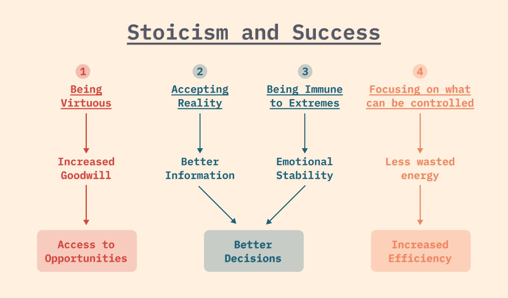

 Research Handbook 
=============================

The `Research Handbook` is a comprehensive guide to modern computer vision with machine learning and deep learning methods and technologies. We summarize various types of machine learning methods, related theory, and the best practices when applying in competitive competitions and real-world applications.

## Knowledge Base
<table>
    <tr>
        <th>Category</th>
        <th>Topics</th>
    </tr>
    <tr>
        <td><b>Machine&nbsp;Learning</b></td>
        <td>
            <a href="">Anomaly&nbsp;Detection</a> &nbsp;&nbsp;
            <a href="">Classification</a> &nbsp;&nbsp;
            <a href="">Clustering</a> &nbsp;&nbsp;
            <a href="">Dimensionality&nbsp;Reduction</a> &nbsp;&nbsp;
            <a href="">Neural&nbsp;Network</a> &nbsp;&nbsp;
            <a href="">Regression</a> &nbsp;&nbsp;
        </td>
    </tr>
    <tr>
        <td><b>Learning&nbsp;Process</b></td>
        <td>
            <a href="">Data&nbsp;Processing</a> &nbsp;&nbsp;
			<a href="">Learning&nbsp;Technique</a> &nbsp;&nbsp;
            <a href="">Model&nbsp;Training</a> &nbsp;&nbsp;
            <a href="">Analysis-Evaluation</a> &nbsp;&nbsp;
            <a href="">Model&nbsp;Deployment</a> &nbsp;&nbsp;
        </td>
    </tr>
    <tr>
        <td><b>Computer&nbsp;Vision</b></td>
        <td>
            <a href="">Action&nbsp;Recognition</a> &nbsp;&nbsp;
            <a href="https://github.com/phlong3105/one/blob/master/docs/image_classification/README.md">Image&nbsp;Classification (Backbone)</a> &nbsp;&nbsp;
            <a href="https://github.com/phlong3105/one/blob/master/docs/image_enhancement/README.md">Image&nbsp;Enhancement</a> &nbsp;&nbsp;
            <a href="">Instance&nbsp;Segmentation</a> &nbsp;&nbsp;
            <a href="">Lane&nbsp;Detection</a> &nbsp;&nbsp;
            <a href="https://github.com/phlong3105/one/blob/master/docs/object_detection/README.md">Object&nbsp;Detection</a> &nbsp;&nbsp;
            <a href="">Object&nbsp;Tracking</a> &nbsp;&nbsp;
            <a href="">Re-identification</a> &nbsp;&nbsp;
            <a href="">Semantic&nbsp;Segmentation</a> &nbsp;&nbsp;
        </td>
    </tr>
    <tr>
        <td><b>Image&nbsp;Processing</b></td>
        <td>
            <a href="">Feature&nbsp;Extraction</a> &nbsp;&nbsp;
            <a href="">Geometry</a> &nbsp;&nbsp;
            <a href="">Image&nbsp;Acquisition</a> &nbsp;&nbsp;
            <a href="">Image&nbsp;Registration</a> &nbsp;&nbsp;
            <a href="">Motion&nbsp;Analysis</a> &nbsp;&nbsp;
            <a href="">Reconstruction</a> &nbsp;&nbsp;
        </td>
    </tr>
    <tr>
        <td><b>Maths</b></td>
        <td>
        </td>
    </tr>
    <tr>
        <td><b>Programming&nbsp;Language</b></td>
        <td>
            <a href="">Swift</a> &nbsp;&nbsp;
            <a href="">Python</a> &nbsp;&nbsp;
        </td>
    </tr>
    <tr>
        <td><b>Resources</b></td>
        <td>
            <a href="https://github.com/phlong3105/one/blob/master/docs/resources/anaconda.md">Anaconda</a> &nbsp;&nbsp;
            <a href="https://github.com/phlong3105/one/blob/master/docs/resources/docker.md">Docker</a> &nbsp;&nbsp;
            <a href="">Effective&nbsp;Study</a> &nbsp;&nbsp;
            <a href="">Pip</a> &nbsp;&nbsp;
            <a href="">Project&nbsp;Management</a> &nbsp;&nbsp;
            <a href="">Writing</a> &nbsp;&nbsp;
        </td>
    </tr>
</table>

## Projects
<table>
    <tr>
        <th>Category</th>
        <th>Projects</th>
    </tr>
    <tr>
        <td><b>Challenges</b></td>
        <td>
            <a href="">AI&nbsp;City&nbsp;Challenge</a> &nbsp;&nbsp;
            <a href="">AutoNUE</a> &nbsp;&nbsp;
            <a href="">KATECH</a> &nbsp;&nbsp;
            <a href="">KODAS</a> &nbsp;&nbsp;
            <a href="">NTIRE</a> &nbsp;&nbsp;
            <a href="">UG2+</a> &nbsp;&nbsp;
            <a href="">VisDrone</a> &nbsp;&nbsp;
            <a href="">Waymo</a> &nbsp;&nbsp;
        </td>
    </tr>
    <tr>
        <td><b>Aerial&nbsp;Vehicle</b></td>
        <td>
        </td>
    </tr>
    <tr>
        <td><b>Autonomous&nbsp;Vehicle</b></td>
        <td>
            <a href="">Autonomous&nbsp;Sensor</a> &nbsp;&nbsp;
            <a href="">Scene&nbsp;Understanding</a> &nbsp;&nbsp;
        </td>
    </tr>
    <tr>
        <td><b>Surveillance&nbsp;System</b></td>
        <td>
            <a href="">Edge&nbsp;TSS</a> &nbsp;&nbsp;
        </td>
    </tr>
</table>

## Misc

