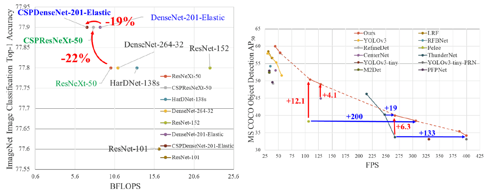
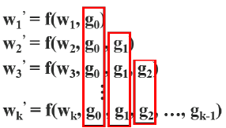
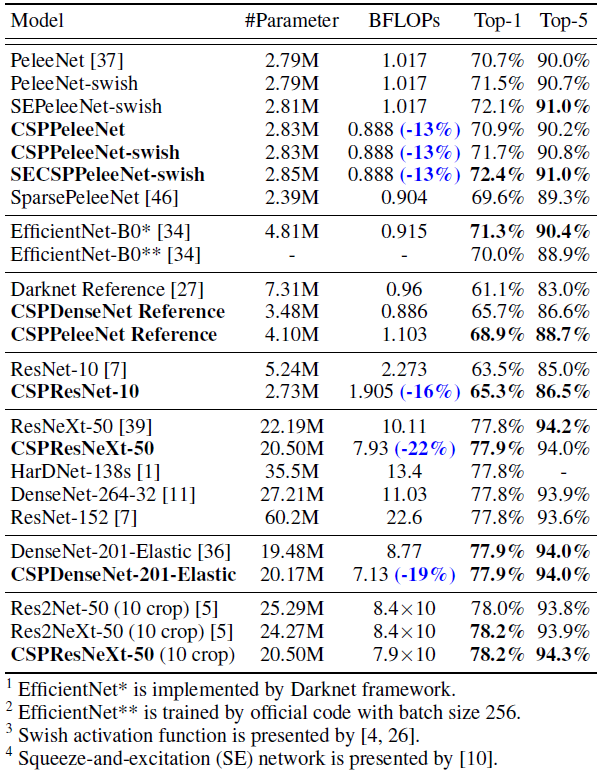

<div align="center">
<br><br>
<div>
	<a href="https://github.com/phlong3105/one/blob/master/handbook/README.md"></a>
</div>

CSPNet: A New Backbone That Can Enhance Learning Capability of CNN
=============================
<div>
	<p>Chien-Yao Wang and Hong-Yuan Mark Liao and Yueh-Hua Wu and Ping-Yang Chen and Jun-Wei Hsieh and I-Hau Yeh</p>
	<p>CVPRW 2020</p>
</div>

<div align="center">
	<a href="data/cspnet.pdf">Paper</a> •
    <a href="https://github.com/WongKinYiu/CrossStagePartialNetworks">Code</a> •
	<a href="https://sh-tsang.medium.com/review-cspnet-a-new-backbone-that-can-enhance-learning-capability-of-cnn-da7ca51524bf">Ref01</a>
</div>
</div>


## Highlight
- **Cross Stage Partial Network (CSPNet)** is designed, to attribute the problem to the duplicate gradient information within network optimization, **complexity can be largely reduced while maintaining the accuracy**. 
- It can be applied to various networks such as DenseNet, ResNeXt and ResNet. **Later on, this CSPNet is used in YOLOv4 and Scaled-YOLOv4**.

<div align="center">
	
	<p>CSPNet not only reduces computation cost and memory usage of the networks, but also benefit on inference speed and accuracy.</p>
</div>


## Method
### 1. Duplicate Gradient Information in DenseNet
<div align="center">
	
	<p>FLOPs of different computational layers with different model scaling factors.</p>
</div>

- In DenseNet, the output of the ith dense layer will be concatenated with the input of the ith dense layer. This concatenated outcome becomes the input of the (i+1)th dense layer:
<div align="center">
	
</div>

- If one makes use of a backpropagation algorithm to update weights, the equations of weight updating can be written as:
<div align="center">
	
</div>

> It is found that large amount of gradient information are reused for updating weights of different dense layers. This will result in different dense layers repeatedly learn copied gradient information.

### 2. CSPNet (CSPDenseNet, CSPResNet & CSPResNeXt)
<details open>
<summary><b style="font-size:16px">Cross Stage Partial DenseNet (CSPDenseNet)</b></summary>

<div align="center">
	
	<p>Cross Stage Partial DenseNet (CSPDenseNet).</p>
</div>

- CSPNet separates feature map of the base layer into two part, one part will go through a dense block and a transition layer; the other one part is then combined with transmitted feature map to the next stage.
- The equations of feed-forward pass and weight updating of CSPDenseNet become:

<div align="center">
	<br/>
	
</div>

- The gradients coming from the dense layers are separately integrated.
- On the other hand, the feature map that did not go through the dense layers is also separately integrated.
- As to the gradient information for updating weights, **both sides do not contain duplicate gradient information that belongs to other sides.**

> The proposed CSPDenseNet preserves the advantages of DenseNet’s feature reuse characteristics, but at the same time prevents an excessively amount of duplicate gradient information by truncating the gradient flow.

</details>

<details open>
<summary><b style="font-size:16px">Partial Dense Block Variants</b></summary>

<div align="center">
	
	<p>Different kind of feature fusion strategies.</p>
</div>

- The purpose of designing partial transition layers is to maximize the difference of gradient combination.
- Two variants are designed.
  - CSP (Fusion First): concatenate the feature maps generated by two parts, and then do transition operation. 
    - If this strategy is adopted, a large amount of gradient information will be reused. 
  - CSP (Fusion last): The output from the dense block will go through the transition layer and then do concatenation. 
    - The gradient information will not be reused since the gradient flow is truncated.

</details>

<details open>
<summary><b style="font-size:16px">Applying CSPNet to Other Architectures</b></summary>

<div align="center">
	
	<p>Applying CSPNet to ResNe(X)t.</p>
</div>

- CSPNet can be also easily applied to ResNet and ResNeXt. 
- Since only half of the feature channels are going through Res(X)Blocks, there is no need to introduce the bottleneck layer anymore.

</details>

### 3. Exact Fusion Model (EFM)
<div align="center">
	
	<p>Different feature pyramid fusion strategies.</p>
</div>

- **EFM is proposed to capture an appropriate Field of View (FoV) for each anchor**, which enhances the accuracy of the one-stage object detector. 
- EFM is proposed to **better aggregate the initial feature pyramid**. 
- Since the concatenated feature maps from the feature pyramid are enormous, it introduces a great amount of memory and computation cost. To alleviate the problem, **the Maxout technique is incorporated to compress the feature maps**.


## Ablation Studies
<details open>
<summary><b style="font-size:16px">CSPNet on ImageNet</b></summary>

<div align="center">
	
	<p>Ablation study of CSPNet on ImageNet.</p>
</div>

- PeleeNet is used as baseline.
- Different partial ratios γ and the different feature fusion strategies are used for ablation study.

> Compared to the baseline PeleeNet, the proposed CSPPeleeNet achieves the best performance, it can cut down 13% computation, but at the same time upgrade the accuracy by 0.2%.
>
> If the partial ratio is adjusted to γ = 0.25, the accuracy is improved by 0.8% and at the same time 3% computation is cut down.

</details>

<details open>
<summary><b style="font-size:16px">EFM on MS-COCO</b></summary>

<div align="center">
	
	<p>Ablation study of EFM on MS COCO.</p>
</div>

- CSPPeleeNet is used as backbone.
- GIoU, SPP (in SPPNet), and SAM (in CBAM) are also applied to EFM for study.
- PRN and ThunderNet are included for comparison.
- Although the introduction of GIoU can upgrade AP by 0.7%, the AP50 is, however, significantly degraded by 2.7%. GIoU training is not used at the end.
- Since SAM is better than SPP, EFM (SAM) is used as **final architecture**.
- In addition, CSPPeleeNet with **Swish activation is not considered** as for consideration of hardware design acceleration.

</details>


## Results
<details open>
<summary><b style="font-size:16px">ImageNet Image Classification</b></summary>

<div align="center">
	
	<p>Compare with state-of-the-art methods on ImageNet.</p>
</div>

- There are a lot of findings here for each CSPNet model. 
- But basically, when the concept of CSPNet is introduced, the computational load is reduced at least by 10% and the accuracy is either remain unchanged or upgraded. 
- CSPResNeXt-50 all achieve the best result. As to the 10-crop test, CSPResNeXt-50 also outperforms Res2Net-50 and Res2NeXt-50.

</details>

<details open>
<summary><b style="font-size:16px"> MS-COCO Object Detection</b></summary>

<div align="center">
	
	<p>Compare with state-of-the-art methods on MS-COCO Object Detection</p>
</div>

- If compared to object detectors running at **30~100 fps, CSPResNeXt50 with PANet (SPP) achieves the best performance** in AP, AP50 and AP75. They receive, respectively, 38.4%, 60.6%, and 41.6% detection rates. 
- If compared to state-of-the-art LRF [38] under the input image size 512×512, CSPResNeXt50 with PANet (SPP) outperforms ResNet101 with LRF by 0.7% AP, 1.5% AP50 and 1.1% AP75. 
- If compared to object detectors running at **100~200 fps, CSPPeleeNet with EFM (SAM) boosts 12.1% AP50 at the same speed as Pelee [37] and increases 4.1% [37] at the same speed as CenterNet [45]**. 
- If compared to very fast object detectors such as ThunderNet [25], YOLOv3-tiny [29], and YOLOv3-tiny-PRN [35], the proposed **CSPDenseNetb Reference with PRN is the fastest**. It can reach **400 fps frame rate**, i.e., 133 fps faster than ThunderNet with SNet49. 
- If compared to ThunderNet146, CSPPeleeNet Reference with PRN (3l) increases the frame rate by 19 fps while maintaining the same level of AP50.

</details>

<details open>
<summary><b style="font-size:16px">Inference Rate</b></summary>

<div align="center">
	
	<p>Inference rate on mobile GPU (mGPU) and CPU real-time object detectors (in fps).</p>
</div>

- The above experiments are based on NVIDIA Jetson TX2 and Intel Core i9–9900K with OpenCV DNN module. No model compression or quantization is applied. 
- Similarly, **with CSPNet applied**, it can achieve **high fps** and **high AP50**.

</details>


## Citation
```text
@inproceedings{Wang2020,
  title	 	= {CSPNet: A new backbone that can enhance learning capability of cnn},
  author 	= {Chien-Yao Wang and Hong-Yuan Mark Liao and Yueh-Hua Wu and Ping-Yang Chen and Jun-Wei Hsieh and I-Hau Yeh},
  booktitle = {CVPRW},
  pages		= {390--391},
  year		= {2020}
}
```
