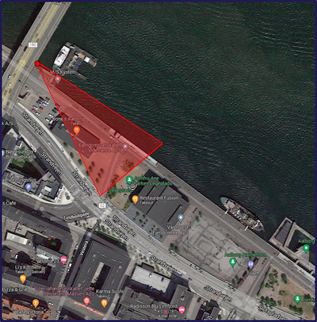
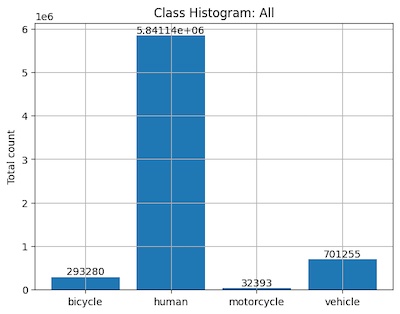
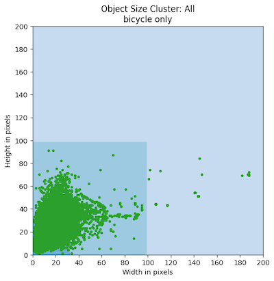
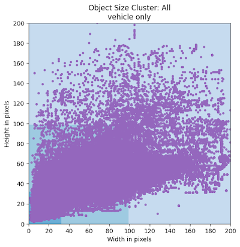
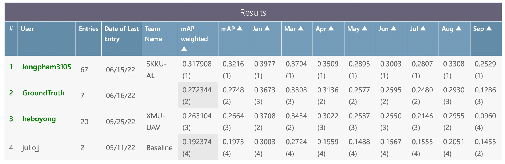

# 2022 Seasons in Drift Challenge at ECCV

[Website](https://chalearnlap.cvc.uab.cat/challenge/51/description/){: .btn .fs-3 .mb-4 .mb-md-0 }

<details open markdown="block">
  <summary>Table of contents</summary>
  {: .text-delta }
  1. TOC
  {:toc}
</details>

---

The challenge will use an extension of the LTD Dataset [1] which consists of
thermal footage that spans multiple seasons. For deployment and long-term use of
machine-learning algorithms in a surveillance context it is vital that the
algorithm is robust to the concept drift that occurs as the conditions in the
outdoor environment changes. This challenge aims to spotlight the problem of
concept drift in a surveillance context and highlight the challenges and
limitations of existing methods. To provide a direction of research for the
future.

## Important Dates

- **04/25/2022 Start of challenge**
	- Release of training- and validation- data (with and without ground truth
	  respectively).


- **06/15/2022 Release of test data (without ground truth) and validation
  labels**
	- Release of test data (without ground truth) and validation labels. At this
	  stage the participants can download an encrypted version of the test-data
	  and validation labels a few days ahead of the release of the decryption
	  key, to ensure that participants regardless of internet connectivity are
	  on an equal footing.


- **06/17/2022 Start of test phase (end of development phase)**
	- Release of the decryption key for test data and validation labels.
	  Participants start predicting the results on the test data. At this stage
	  they can retrain (or fine-tune) their models with the additional
	  validation set.


- **06/24/2022 End of the Challenge**
	- Deadline for submitting the final predictions over the test (evaluation)
	  data.


- **06/26/2022 Code and fact sheets submission**
	- Deadline for Code submission with detailed instructions (known as "code
	  verification stage"). This includes a list of requirements, pretrained
	  models, and so on. Note, training code with instructions is also required.
	  Organizers strongly encourage the use of docker to facilitate
	  reproducibility.
	- In addition to the code, participants are requested to submit the fact
	  sheets using a template (TBD) provided by the organizers.
	- Additional details about code and fact sheets submission are provided in
	  our challenge webpage, winning solutions (Post challenge) section.


- **07/07/2022 Release of final results**

We encourage participants to submit a paper to the associated workshop,
independently of their rank position.

- Paper submission: – July 1st, 2022
- Paper submission for challenge participants: – July 5th, 2022
- Decision notification: – July 10th, 2022
- Camera ready: – July 15th, 2022

## Data

The LTD dataset used in the Seasons in Drift Challenge at ECCV'22 is an
extension of an existing concept drift dataset and spans 188 days in the period
of 14th May 2020 to 30th of April 2021, with a total of 1689 2-minute clips
sampled at 1fps with associated bounding box annotations for 4 classes (Human,
Bicycle, Motorcycle, Vehicle). The collection of this dataset has included data
from all hours of the day in a wide array of weather conditions overlooking the
harborfront of Aalborg, Denmark. In this dataset depicts the drastic changes of
appearance of the objects of interest as well as the scene over time in a static
surveillance context to develop robust algorithms for real-world deployment.

|  |
|:-----------------------------------------------------------------------------:|
|                                 Camera Setup.                                 |

```text
######### Object Size Grouping Scheme #########
Small (<1024 pixels)
Medium (1025-9695 pixels)
Large (>9696 pixels)

############### Subset Overview ###############
Subset name   :  Full-All
Clips         :  1689
Different days:  188
Timespan      :  2020-05-14 - 2021-04-30
-------------- Object Presence ----------------
Empty frames  : 844638 (78.9937217499792 %)
Frames /w obj : 224609 (21.00627825002081 %)
Total frames  : 1069247

########### Object Distributions ##############
All*          : 6868067
bicycle       : 293280
human         : 5841139
motorcycle    : 32393
vehicle       : 701255
Unique Objects: 143294
------------------- Small ---------------------
All*          : 6092590
bicycle       : 288081
human         : 5663804
motorcycle    : 27153
vehicle       : 113552
------------------- Medium --------------------
All*          : 37468
bicycle       : 7
human         : 454
vehicle       : 37007
------------------- Large ---------------------
All*          : 738009
bicycle       : 5192
human         : 176881
motorcycle    : 5240
vehicle       : 550696
###############################################
```

|                                |
|:-----------------------------------------------------------------------------------------------------------------:|
|        |
|            |
|  |
|        |

## Tasks

This challenge is split into **3 different tracks** associated with thermal
object detection. Each track will have the same evaluation criteria/data but
will vary with both the amount of data as well as the time span of the data. The
training data is chosen by selecting the coldest day, and surrounding data as
cold environments introduce the least amount of concept drift. Each track aims
at evaluating how robust a given detection method is to concept drift, by
training on limited data from a specific time period (**day, week, month** in
February) and evaluation performance across time, by validating and testing
performance on months of unseen data (Jan., May., Apr., May., Jun., Jul., Aug.
and Sep.).

* Track 1: Detection at day
  level ([competition link](https://codalab.lisn.upsaclay.fr/competitions/4272)):
  Train on a predefined and single day data and evaluate concept drift across
  time. The day is the **13th of February 2020** as it is the coldest day in the
  recorded data, due to the relative thermal appearance of objects being the
  least varied in colder environments this is our starting point.

* Track 2: Detection at week
  level ([competition link](https://codalab.lisn.upsaclay.fr/competitions/4273)):
  Train on a predefined and single week data and evaluate concept drift across
  time. The week selected is the week of the **13th – 20th of February 2020** (
  i.e. expanding from our starting point)

* Track 3: Detection at month
  level ([competition link](https://codalab.lisn.upsaclay.fr/competitions/4276)):
  Train on a predefined and single month data and evaluate concept drift across
  time. And the selected month is the **entire month of February**.

The competition will be run on CodaLab platform. Register on CodaLab in the
following links to get access to the decryption keys for
training/validation/test data (according to our schedule), and submit
predictions during the development and test phase of the challenge. Pick a
track (or all tracks) to follow and train on the respective training splits.
Depending on the track chosen the training data will vary, however the
validation and testing data will remain the same across all challenges.

By submitting a ".pkl" file to the codalab challenge following the format
provided in the starting kit and complying with the challenge rules and the
submission will be listed on the leaderboard and ranked.

## Phases

Each track will be composed of two phases, i.e., development and test phase. At
the development phase, public train data will be released and participants will
need to submit their predictions with respect to a validation set. At the test (
final) phase, participants will need to submit their results with respect to the
test data, which will be released just a few days before the end of the
challenge. That is, in the initial development phase only data from the month of
February will have annotations, and the images for validation of the other month
will be available. As we progress into the test phase, annotations will become
available together with the test images for the final submission.

Participants will be ranked, at the end of the challenge, using the test data.
It is important to note that this competition involves the submission of
results (and not code). Therefore, participants will be required to share their
codes and trained models after the end of the challenge (with detailed
instructions) so that the organizers can reproduce the results submitted at the
test phase, in a "code verification stage". At the end of the challenge, top
ranked methods that pass the code verification stage will be considered as valid
submissions to compete for any prize that may be offered.

## Submission

To submit your predicted results (on each of the phases), you first have to
compress your "predictions.pkl" file (please, keep the filename as it is) as "
the_filename_you_want.zip". To avoid any incompatibility with different python
versions, please save your pickle file using protocol = 4. Then,

* sign in on Codalab -> go to our challenge webpage (and associated track) on
  codalab -> go on the "Participate" tab -> "Submit / view results" -> "Submit"
  -> then select your "the_filename_you_want.zip" file and -> submit.

* **Warning**: the last step ("submit") may take some minutes (e.g., >10min)
  with status "Running" due to the amount of computation and availble Codalab
  resources (just wait). If everything goes fine, you will see the obtained
  results on the leaderboard ("Results" tab).

* Note, Codalab will keep on the leaderboard the last valid submission. This
  helps participants to receive real-time feedback on the submitted files.
  Participants are responsible to upload the file they believe will rank them in
  a better position as a last and valid submission.

**Warning**: the maximum number of submissions per participant at the test stage
will be set to 3. Participants are not allowed to create multiple accounts to
make additional submissions. The organizers may disqualify suspicious
submissions that do not follow this rule.

## Evaluation

We follow the COCO evaluation scheme for mAP. The primary metric is, mAP across
10 different IoU thresholds (ranging from 0.5 to .95 at 0.05 increments). This
is calculated for each month in the validation/test set and the model is then
ranked based on a weighted average of each month (more distant months having a
larger weight as more concept drift is present). The evaluation is performed
leveraging the official COCO evaluation tools

The baseline is a YOLOv5 with the default configuration from the Ultralytics
repository, including augmentations. In depth logs and examples for the baseline
can be found in the Weights and Biases repository. The baseline is trained with
a batch size of 64 for 300 epochs, with an input image size of 384x288 and the
best performing model is chosen. For the dev phase the performance is validated
on the training set. For the Test phase new baseline models will be submitted (
validated on the validation set). Naturally, the labels are converted to the
normalized yolo format ([cls] [cx] [cy] [w] [h]) for both training and
evaluation. For submission they are converted back to
the ([cls] [tl_x] [tl_y] [br_x] [br_y]) coordinates. The models were all trained
on the same machine with 2x Nvidia RTX 3090 GPUs, all training is also conducted
as multi GPU training using the pytorch distributed learning module.

## Rules

According to the Terms and Conditions of the Challenge,

* "the maximum number of submissions per participant at the test stage will be
  set to 3. Participants are not allowed to create multiple accounts to make
  additional submissions. The organizers may disqualify suspicious submissions
  that do not follow this rule."

* "in order to be eligible for prizes, top ranked participants’ score must
  improve the baseline performance provided by the challenge organizers."

* "the performances on test data will be verified after the end of the challenge
  during a code verification stage. Only submissions that pass the code
  verification will be considered to be in the final list of winning methods;"

* "to be part of the final ranking the participants will be asked to fill out a
  survey (fact sheet) where a detailed and technical information about the
  developed approach is provided."

## Methods

### Track 3: Month

| Status | Method                                                                                 |   Team ID    | Rank | Architecture | Date | Publication     |
|:------:|----------------------------------------------------------------------------------------|:------------:|:----:|--------------|------|-----------------|
|        | [WeightedConf](https://phlong3105.github.io/one/vision/object_detection/weighted_conf) | longpham3105 |  1   | Deep         |      | ECCVW&nbsp;2022 |

|  |
|:-------------------------------------------------------------------------------------------------------:|
|                                        Development phase results                                        |
