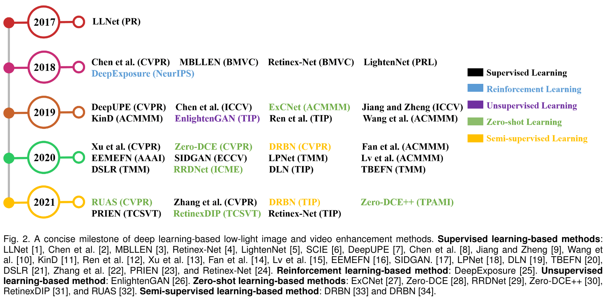
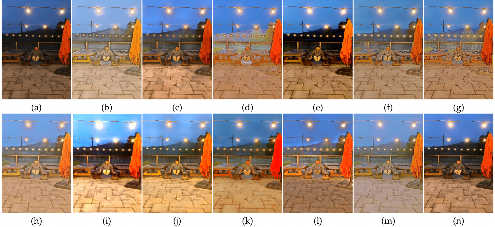

# Low-Light Enhancement (LLE)

<details open markdown="block">
  <summary>Table of contents</summary>
  {: .text-delta }
  1. TOC
  {:toc}
</details>

---

Images captured in low-light and uneven brightness conditions have a low dynamic range with high noise levels. These qualities can lead to degradation of the overall performance of computer vision algorithms that process such images.

**Low-light image enhancement (LLE)** aims at improving the perception or interpretability of an image captured in an environment with poor illumination.

There are two main categories: [**traditional methods**](#traditional-methods) (such as [HE](#histogram-equalization-algorithm), [physical model](#physical-model), and [Retinex model](#retinex-model)) and [**deep learning methods**](#deep-learning-model). 

---

## Traditional Methods

### Histogram Equalization Algorithm

Histogram equalization is a simple and fast method to enhance images with insufficient illumination and low contrast.

The HE algorithm enhances the image through the image gray histogram. 

When the grayscale histogram of the image is concentrated in a grayscale interval, the concentrated grayscale interval is stretched to the entire grayscale interval of the histogram through transformation, the grayscale range of the image is expanded and distributed uniformly, and the contrast is improved.

**Drawback:** loss of detailed information due to gray level merging.

### Physical Model

The most commonly used low-light enhancement algorithms based on physical models are the **atmospheric scattering model** and the [Retinex model](#retinex-model-ssr).

**Atmospheric scattering**. Experiments found that the inversion image of the low-light image is very similar to the foggy image. Hence the proposed algorithm is as follows. First, invert the low-light image, apply the defogging algorithm proposed by He et al., and finally, the processed image is inverted to obtain an enhanced image.

### Retinex Model

Retinex is a combination of the words retina and cortex. [**Retinex model**](#retinex-model-ssr) is more popular and is based on the human visual system.

> Through experiments, Land et al. found that **the intensity of light irradiated on the object does not determine the object's color but is determined by the object’s reflection**. 

Therefore, the unevenness of the illumination will not affect the color of the object seen by the human eye, which is the color constancy. Hence, the theoretical model is the illumination component. $I$ and the reflectivity component $R$ work together to form the original image $S$ seen by the human eye. 

#### Single-scale Retinex (SSR)

The image formulation equation is $$S(x,y) = R(x,y) \bullet I(x,y)$$, where the light component is $I(x,y)$, the reflection property of the object is $R(x,y)$ and the image seen by the human eye is $S(x,y)$.

The enhancement principle is to obtain the illumination component $I$ by decomposing the original image $S$, then remove or reduce the influence of $I$, and finally get the enhanced result.

Therefore, to decompose and obtain the reflection component $R(x,y)$, it is necessary to take the logarithm of both sides of Eq. (1) and change the product relationship into an addition and subtraction relationship, that is, $$\log(S(x,y)) = \log(R(x,y)) + \log(I(x,y))$$

In the Retinex theory, the illumination component changes slowly and belongs to the low frequency component, and the reflection component belongs to the high frequency component. It is calculated by approximate estimation when solving the illumination component. It is calculated by approximate estimation when solving the illumination component $I(x,y)$, $$\log(I(x,y)) = \log[F(x,y) \ast S(x,y)],$$ $$\log(R(x,y)) = \log(S(x,y)) - \log[F(x,y) \ast S(x,y)],$$ where $F(x,y)$ is the convolution kernel and $c$ is the Gauss surround scale: $$F(x,y) = K \exp \Big[ \frac{- (x^2 + y^2)}{c^2} \Big].$$

#### Multiscale Retinex (MSR)

In response to the problem in [SSR](#single-scale-retinex-ssr), Jobson et al. proposed a multiscale Retinex algorithm. The equation is: $$R(x,y) = \sum^N_{n=1} w_n \{ \log\big(S(x,y)\big) - \log\big[F_n(x,y) \ast S(x,y)\big] \},$$ where $k$ is the number of the convolution kernel. When the number $K=1$, MSR is SSR.

---

## Deep Learning Model
Deep learning-based LLE models come in with a wide variety of structures and sizes. We summarize some of the most important models in this section, such as:

|                               |
|:-----------------------------------------------------------------:|
| A concise milestone of deep learning-based low-light enhancement. |


|                                                                                                                                                                                                             |
|:----------------------------------------------------------------------------------------------------------------------------------------------------------------------------------------------------------------------------------------------:|
| A statictic analysis of deep learning-based LLIE methods, including learning strategy, network characteristic, Retinex model, data format, loss function, training dataset, testing dataset, and evaluation metric. Best viewed by zooming in. |

### Problem Formulation

For a low-light image $I \in \mathbb{R}^{W \times H \times 3}$ of width $W$ and height $H$, the process can be modeled as: $$\hat{R} = \mathcal{F}(I;\theta),$$ where $\hat{R} \in \mathbb{R}^{W \times H \times 3}$ is the enhanced result and $\mathcal{F}$ represents the network with trainable parameters $\theta$.

The purpose of the deep learning is to find optimal network parameter $\hat{\theta}$ that minimize the error: $$\hat{\theta} = \operatorname*{arg\,min}_{\theta} \mathcal{L}(\hat{R}, R),$$ where $R \in \mathbb{R}^{W \times H \times 3}$ is the ground-truth, and the loss function $\mathcal{L}(\hat{R}, R)$ drives the optimization of network.

### Learning Strategies

According to different learning strategies, we categorize existing LLE methods into [supervised learning](), [reinforcement learning](), [unsupervised learning](), [zero-shot learning](), and [semi-supervised learning]().

```plantuml
object "Learning Strategy" as ls
object "Supvervised Learning" as sl
object "End-to-End" as e2e
object "Deep Retinex-based" as retinex
object "Realistic Data-Driven" as dd
object "Reinforcement Learning" as rl
object "Unsupervised Learning" as usl
object "Semi-Supervised Learning" as ssl
object "Zero-Shot Learning" as zsl
ls <-- sl
sl <-- e2e
sl <-- retinex
sl <-- dd
ls <-- rl
ls <-- usl
ls <-- ssl
ls <-- zsl
```

### Network Structure

The most commonly used network structures and designs have been the basic **U-Net**, **pyramid network**, **multi-stage network** to **frequency decomposition network**.

**U-Net and U-Net like networks** are mainly adopted network structure in LLE. This is because U-Net can effectively integrate multiscale features and employ both low-level and high-level features. Such characteristics are essential for achieving satisfactory low-light enhancement.

> **Drawbacks:**
> * **Gradient vanishing**: after going through several convolutional layers, the gradients of an extremely low light image may vanish during the gradient back-propagation *due to its small pixel values*. This would degrade the enhancement performance and affect the convergence of network training.
> * **Skip-connection**: the skip-connections used in the U-Net like networks might introduce noise and redundant features into the final results. How to effectively filter out the noise and integrate both low-level and high-level features should be carefully considered.
> * **Specialize network structure**: most components in LLE networks are borrowed or modified form related low-level visual tasks. The characteristics of low-light data should be considered when designing the network structure.

### Applying Retinex Theory

Almost 1/3 of methods combine the designs of deep networks with [Retinex theory](#retinex-model), e.g., designing different subnetworks to estimate the components of the Retinex model and estimating the illumination map to guide the learning of networks.

> **Drawback:**
> * The ideal assumption that the reflectance is the final enhanced result used in Retinex-based LLE methods would still affect the final results.
> * The risk of overfitting in deep networks still exists despite the use of Retinex theory. How to cream off the best and filter out the impurities should be carefully considered when researchers combine deep learning with the Retinex theory.

### Loss Functions

The commonly adopted loss functions in LLE models include five main types: reconstruction loss, perceptual loss, smoothness loss, adversarial loss, and exposure loss. The table below summarizes them all.

The commonly used loss functions in LLE networks are also employed in image reconstruction networks for image super-resolution, image denoising, image detraining, and image deblurring.

| Loss                 | Type                | Description                                                                                                                                                                                                                                                                                                                                                                                                                                                          |
|:-------------------- |:------------------- | -------------------------------------------------------------------------------------------------------------------------------------------------------------------------------------------------------------------------------------------------------------------------------------------------------------------------------------------------------------------------------------------------------------------------------------------------------------------- |
| **$L_1$**            | Reconstruction Loss | Preserve colors and illuminance well since an error is weighted equally regardless of the local structure.                                                                                                                                                                                                                                                                                                                                                           |
| **$L_2$**            | Reconstruction Loss | Tend to penalize large errors but is tolerant to small errors.                                                                                                                                                                                                                                                                                                                                                                                                       |
| **SSIM**             | Reconstruction Loss | Preserve the structure and texture well.                                                                                                                                                                                                                                                                                                                                                                                                                             |
| **Perceptual Loss**  | Perceptual Loss     | Also known as **feature reconstruction loss**. It is proposed to constrain the results similar to the ground-truth in the feature space. The loss improves the visual quality of results. <br><br> It is defined as the Euclidean distance between the feature representations of an enhanced result and those of corresponding ground truth. <br><br> The feature representations are typically extracted from the **VGG network pre-trained on ImageNet dataset**. |
| **Smoothness Loss**  | Smoothness Loss     | Also known as **TV Loss**. It is used to constrain the enhanced result. It can remove noise in the enhanced results or preserve the relationship of neighboring pixels.                                                                                                                                                                                                                                                                                              |
| **Adversarial Loss** | Adversarial Loss    | It is used to encourage enhanced results to be in distinguishable from reference images.                                                                                                                                                                                                                                                                                                                                                                             |
| **Exposure Loss**    | Exposure Loss       | One of the key non-reference losses. It measures the exposure levels of enhanced results without paired or unpaired images as reference images.                                                                                                                                                                                                                                                                                                                      |

> **Idea:**
> * A non-reference loss makes a model enjoy better generalization capability. Ongoing research considers image characteristics for the design of loss functions.

### Evaluation Metrics

Besides human perception-based subjective evaluations, image quality assessment (IQA) metrics, including both full-reference and non-reference IQA metrics, 

The most commonly used evaluation metrics in LLE methods are summarized in the table below:

| Metric          | Description                                                                                                                                                                                                                                                                               |
| --------------- | ----------------------------------------------------------------------------------------------------------------------------------------------------------------------------------------------------------------------------------------------------------------------------------------- |
| **PSNR**        | Non-negative and values closer to **infinite** are. <br> May provide an inaccurate indication of the visual perception of image quality since they neglect the relation of neighboring pixels.                                                                                            |
| **MSE**         | Non-negative and values closer to **zero** are better. <br> May provide an inaccurate indication of the visual perception of image quality since they neglect the relation of neighboring pixels.                                                                                         |
| **MAE**         | Also known as: mean absolute error. <br> Serving as a measure of errors between paired observations. <br> The **smaller** the MAE value **is**, the **better** similarity is.                                                                                                             |
| **SSIM**        | Measure the similarity between two images. It is a perception-based model that considers image degradation as perceived change in structural information. <br> The **value 1** is only reachable in the case of two **identical** sets of data, indicating perfect structural similarity. |
| **LOE**         | Represents the lightness order error that reflects the naturalness of an enhanced image. <br> The smaller the LOE value is, the better the lightness order is preserved.                                                                                                                  |
| **Application** | Besides improving the visual quality, one of the purposes of image enhancement is to serve high-level visual tasks. <br> Thus, the effects of LLIE on high-level visual applications are commonly examined to validate the performance of different methods.                                    | 

> **Drawbacks:**
> * All IQA metrics are far from capturing real visual perception of human.
> * Some metrics are not originally designed for low-light images. They are used for accessing the fidelity of image information and contrast. Using these metrics may reflect the image quality, but they are from the real purpose of LLE.
> * Metrics especially designed for low-light images are lacking, except for the LOE metric.
> * No metric for evaluating low-light video.
> * **A metric that can balance both the human vision and the machine perception is expected.**

### Data Format

**RGB** data format dominates most methods as it is commonly found as the final imagery form produced by smartphone cameras, Go-Pro cameras, and drone cameras.

**Raw** data are limited to specific sensors such as those based on Bayer patterns, the data cover wider color gamut and higher dynamic range.

> **Remarks:**
> * Deep learning models trained on raw data usually recover clear details and high contrast, obtain vivid color, reduce the effects of noises and artifacts, and improve the brightness of extremely low-light images.
 
> **Idea:**
> * In future research, a smooth transformation from raw data of different patterns to RGB format would have the potentials to combine the convenience of RGB data and the advantage of high-quality enhancement of raw data for LLE.   

### Data

Training datasets:

|                Name |  Number  | Format | Real/Sync | Video |
| -------------------:|:--------:|:------:|:---------:|:-----:|
|    Gamma Correction | $+ \inf$ |  RGB   |   Sync    |       |
| Random Illumination | $+ \inf$ |  RGB   |   Sync    |       |
|                 LOL |   500    |  RGB   |   Real    |       |
|                SCIE |  4,413   |  RGB   | Real+Sync |       |
|     MIT-Adobe FiveK |  5,000   |  raw   |   Real    |       |
|                 SID |  5,094   |  raw   |   Real    |       |
|                 DRV |   202    |  raw   |   Real    |  ✔️   | 
|               SMOID |   179    |  raw   |   Real    |  ✔️   |

Testing datasets:

|     Name | Number | Format | Application | Video |
| --------:|:------:|:------:|:-----------:|:-----:|
|     LINE |   10   |  RGB   |             |       |
|      NPE |   84   |  RGB   |             |       |
|      MEF |   17   |  RGB   |             |       |
|     DCIM |   64   |  RGB   |             |       |
|   $VV^2$ |   24   |  RGB   |             |       |
| BDD-100K | 10,000 |  RGB   |     ✔️      |  ✔️   |
|   ExDARK | 7,363  |  RGB   |     ✔️      |       |
|    SMOID |  179   |  RGB   |     ✔️      |       |
| VE-LOL-H | 10,940 |  RGB   |     ✔️      |       |


### Results

|                                                |
|:--------------------------------------------------------------------------------------:|
| Visual results of different models on a low-light image sampled from LOL-test dataset. | 

|                                                             |
|:---------------------------------------------------------------------------------------------------:|
| Visual results of different methods on a low-light image sampled from MIT-Adobe FiveK-test dataset. | 

|                                                                                                                                                                                                                                        |
|:------------------------------------------------------------------------------------------------------------------------------------------------------------------------------------------------------------------------------------------------------------------------------:|
| Visual results of different methods on a low-light image sampled from LLIV-Phone-imgT dataset. (a) input. (b) LLNet. (c) LightenNet. (d) Retinex-Net. (e) MBLLEN. (f) KinD. (g) KinD++. (h) TBEFN. (i) DSLR. (j) EnlightenGAN. (k) DRBN. (l) ExCNet. (m) Zero-DCE. (n) RRDNet. | 

|                                                                                                                                                                                                                                        |
|:------------------------------------------------------------------------------------------------------------------------------------------------------------------------------------------------------------------------------------------------------------------------------:|
| Visual results of different methods on a low-light image sampled from LLIV-Phone-imgT dataset. (a) input. (b) LLNet. (c) LightenNet. (d) Retinex-Net. (e) MBLLEN. (f) KinD. (g) KinD++. (h) TBEFN. (i) DSLR. (j) EnlightenGAN. (k) DRBN. (l) ExCNet. (m) Zero-DCE. (n) RRDNet. | 

### Open Issues

**Generalization Capability**:
*  **The existing methods have limited generalization capability**. * For example, a method trained on MIT-Abode FiveK dataset cannot effectively enhance the low-light images of LOL dataset. 
* Albeit synthetic data are used to augment the diversity of training data, the models trained on the combination of real and synthetic data cannot solve this issue well.

**Removing Unknown Noises**: 
* The existing methods **cannot remove the noises well and even amplify the noises, especially when the types of noises are unknown**. 
* Despite some methods add Gaussian and/or Poisson noises in their training data, the noise types are different from real noises, thus the performance of these methods is unsatisfactory in real scenarios.

**Removing Unknown Artifacts**: 
* One may enhance a low-light image downloaded form the Internet. The image may have gone through a serial of degradations such as JPEG compression or editing. **Thus, the image may contains unknown artifacts**. 
* Suppressing unknown artifacts still challenges existing LLE methods.

**Correcting Uneven Illumination**: 
* Images take from real scenes usually exhibit uneven illumination. For example, an image captured at night has both dark regions and normal-light, or over-exposed regions such as the regions of light sources. 
* **Existing methods tend to brighten both the dark regions and the light source regions, affecting the visual quality of the enhanced result**. It is expected to enhance dark regions but suppress over-exposed regions.

**Distinguishing Semantic Regions**:
* Existing methods tend to enhance a low-light image without considering the semantic information of its different regions. For example, the black hair of a man in a low-light image is enhanced to be off-white as the black hair is treated as the low-light regions. 
* An ideal enhancement method is expected to only enhance the low-light regions induced by external environments. 
* How to distinguish semantic regions is an open issue.

**Using Neighboring Frames**: 
* Despite some methods that have been proposed to enhance low-light videos, they commonly process a video frame-by-frame. How to make full use of the neighboring frames to improve the enhancement performance and speed up the processing speed is an unsolved open issue. 
* For example, the well-lit regions of neighboring frames are used to enhance the current frame. 
* For another example, the estimated parameters for processing neighboring frames can be reused to enhance the current frame for reducing the time of parameter estimation.

### Future Research Directions

**Effective Learning Strategies:**
* LLE models mainly adopt supervised learning which leads to overfitting on the training data.
* Zero-shot learning has shown robust performance for real scenes while not requiring paired training data. The unique advantages suggests ZSL as a potential research direction, especially on the formulation of zero-reference losses, deep priors, and optimization strategies.

**Specialized Network Structures:**
* U-Net and U-Net like structures require high memory footprint and long inference time due to their large parameter space. Such network structures are unacceptable for practical applications.
* Neural architecture search (NAS) technique and Transformer architecture may be a potential research direction.

**Loss Function:**
* Loss functions constrain the relationships between an input image and ground truth and drive the optimization of deep networks.
* In LLE, the commonly used loss functions are borrowed from related vision tasks. Thus, designing loss functions that are more well-suited for LLIE is desired. 
* Recent studies have shown the possibility of using deep neural networks to approximate human visual perception of image quality

**Realistic Training Data:**
* Although there are several training datasets for LLIE, their authenticity, scales, and diversities fall behind real low-light conditions. 
* Thus, current LLE deep models cannot achieve satisfactory performance when encountering low-light images captured in real-world scenes.

**Standard Test Data:**
* Currently, there is no well-accepted LLIE evaluation benchmark. Researchers prefer selecting their test data that may bias to their proposed methods. 
* Despite some researchers leave some paired data as test data, the division of training and test partitions are mostly ad-hoc across the literature.

**Task-Specific Evaluation Metrics:**
* The commonly adopted evaluation metrics in LLIE can reflect the image quality to some extent. However, how to measure how good a result is enhanced by an LLE method still challenges current IQA metrics, especially for non-reference measurements.
* The current IQA metrics either focus on human visual perceptual such as subjective quality or emphasize machine perceptual such as the effects on high-level visual tasks.

**Robust Generalization Capability:**
* Observing the experimental results on real-world test data, most methods fail due to their limited generalization capability. 
* The poor generalization is caused by several factors such as synthetic training data, small-scaled training data, ineffective network structures, or unrealistic assumptions.

**Extension to Low-Light Video Enhancement**:
* A direct application of existing LLIE methods to videos often leads to unsatisfactory results and flickering artifacts. 
* More efforts are needed to remove visual flickering effectively, exploit the temporal information between neighboring frames, and speed up the enhancement speed.

**Integrating Semantic Information:**
* Semantic information is crucial for low-light enhancement. It guides the networks to distinguish different regions in the process of enhancement.
* A network without access to semantic priors can easily deviate the original color of a region, e.g., turning black hair to gray color after enhancement. 
* Therefore, integrating semantic priors into LLIE models is a promising research direction.

---

## Further Reading

- [ ] Read more about loss functions: H. Zhao, O. Gallo, I. Frosio, and J. Kautz, “Loss functions for image restoration with neural networks,” TIP, vol. 3, no. 1, pp. 47–56, 2017.
