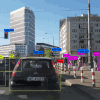
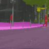

# Vision

---

## Methods

Vision covers a wide range of tasks and applications which has become the backbone of modern AI. 

Meanwhile image processing handles what can be called low-level vision where each task has a deterministic nature.

|          [**Action Recognition &nbsp;**](action_recognition.md)        |              [**Action Detection &nbsp;**](action_detection.md)           |        [**Image Classification**](image_classification.md)     |    [**Image Enhancement**](image_enhancement.md) |
|:--------------------------------------------------------------------------------------------------------------------------------------------------------------------------------------------------:|:--------------------------------------------------------------------------------------------------------------------------------------------------------------------------------------------------:|:------------------------------------------------------------------------------------------------------------------------------------------------------------------------------:|:----------------------------------------------------------------------------------------------------------------------------------------------------------------------------:|
|    [**Instance   Segmentation**](instance_segmentation.md) |                   [**Lane Detection &nbsp;**](lane_detection.md)                |    [**Object Detection &nbsp;**](object_detection.md) |             [**Object Tracking &nbsp;**](object_tracking.md)           |
|                       [**Reidentification &nbsp;**](reidentification.md)                   |    [**Semantic   Segmentation**](semantic_segmentation.md) |                                                                                                                                                                                |                                                                                                                                                                              |

