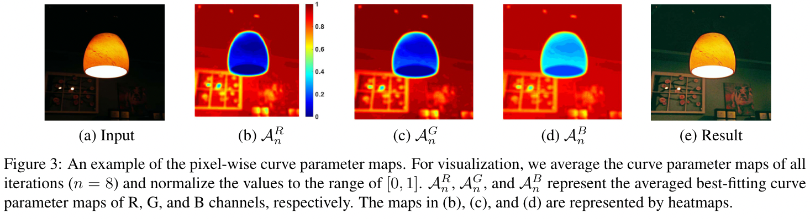
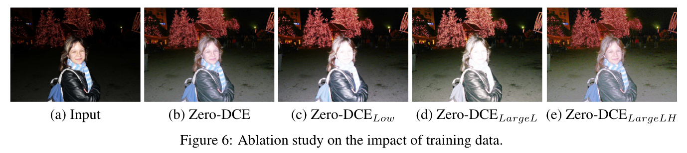

# Zero-Reference Deep Curve Estimation for Low-Light Image Enhancement

Chunle Guo, Chongyi Li, Jichang Guo, Chen Change Loy, Junhui Hou, Sam Kwong, and Cong Runmin

CVPR 2020

[Website](https://li-chongyi.github.io/Proj_Zero-DCE.html){: .btn .fs-3 .mb-4 .mb-md-0 }
[Paper](data/zero_dce.pdf){: .btn .fs-3 .mb-4 .mb-md-0 }
[Supplement](data/zero_dce_sup.pdf){: .btn .fs-3 .mb-4 .mb-md-0 }
[Code](https://github.com/Li-Chongyi/Zero-DCE){: .btn .fs-3 .mb-4 .mb-md-0 }

<details open markdown="block">
  <summary>Table of contents</summary>
  {: .text-delta }
  1. TOC
  {:toc}
</details>

---

## Highlight

We propose the first [low-light enhancement](low_light_enhancement.md) network that is **independent of paired and unpaired training data** ([Zero-Shot Learning](../machine_learning/zero_shot.md)), thus avoiding the risk of overfitting. As a result, our method generalizes well to various lighting conditions.

Zero-DCE formulates the light enhancement as a task of **image-specific curve estimation**, which takes a lowlight image as input and produces high-order curves as its output. These curves are used for pixel-wise adjustment on the dynamic range of the input to obtain an enhanced image.

Besides, unlike the image reconstruction-based methods that need high computational resources, the image-to-curve mapping only requires lightweight networks, thus achieving a fast inference speed. It is capable of processing images in real-time **(about 500 FPS for images of size 640x480x3 on GPU)** and takes only 30 minutes for training.

## Method

|  |
|:-----------------------------------:|

**Framework overview**: a [Deep Curve Estimation Network (DCE-Net)](#dce-net) is devised to estimate a set of best-fitting [Light-Enhancement curves (LE-curves)](#le-curve) given an input image. The framework then maps all pixels of the input's RGB channels by applying the curves iteratively for obtaining the final enhanced image. 

### DCE-Net

|                                |
|:-----------------------------------------------------------:|
| The architecture of Deep Curve Estimation Network (DCE-Net) |

The DCE-Net contains 7 convolutional layers with symmetrical skip-connection.
* In the first 6 convolutional layers, each convolutional layer consists of 32 convolutional kernels of size $3 \times 3$ and stride 1 followed by the ReLU activation function. 
* We discard the down-sampling and batch normalization layers that break the relations of neighboring pixels.
* The last convolutional layer consists of 24 convolutional kernels of size $3 \times 3$ and stride 1 followed by the Tanh activation function, which produces 24 curve parameter maps for 8 iterations ($n=8$), where each iteration requires three curve parameter maps for the three channels (i.e., RGB channels).

It is noteworthy that DCE-Net only has 79,416 trainable parameters and 5.21G Flops for an input image of size $256 \times 256 \times 3$.

### LE-curve

Inspired by the curves adjustment used in photo editing software, we attempt to design a kind of curve that can map a low-light image to its enhanced version automatically, where the self-adaptive curve parameters are solely dependent on the input image.

**Three objectives in the design of the LE-curve:**
* Each pixel value of the enhanced image should be in the normalize range of [0, 1] to avoid information loss induced by overflow truncation.
* The curve should be monotonous to preserve the differences (contrast) of neighboring pixels.
* The form of this curve should be as simple as possible and differentiable in the process of gradient back-propagation.

#### Basic Quadratic Curve

$$LE\big(I(x);\alpha \big) = I(x) + \alpha I(x)\big(1 - I(x)\big), (1)$$ where x denotes pixel coordinates, $LE\big(I(x);\alpha \big)$ is the enhanced version of the given input $I(x)$, $\alpha \in [-1, 1]$ is the trainable curve parameter, which adjusts the magnitude of LE-curve and also controls the exposure level. Each pixel is normalized to $[0, 1]$ and all operations are pixel-wise.

We separately apply the LE-curve to three RGB channels instead of solely on the illumination channel. The three-channel adjustment can better preserve the inherent color and reduce the risk of over-saturation.

The LE-curve enables us to increase or decrease the dynamic range of an input image. This capability is conducive to not only enhancing low-light regions but also removing over-exposure artifacts.

#### Higher-Order Curve

The LE-curve defined in Eq. (1) can be applied iteratively to enable more versatile adjustment to cope with challenging low-light conditions.

$$LE_{n}(x) = LE_{n-1}(x) + \alpha_{n}LE_{n-1}(x)\big(1 - LE_{n-1}(x)\big), (2)$$ where $n$ is the number of iteration, which controls the curvature. In this paper, we set the value of $n$ to 8, which can deal with most cases satisfactory. Eq. (2) can be degraded to Eq. (1) when $n$ is equal to 1.

#### Pixel-Wise Curve

The [higher-order curve](#higher-order-curve) can adjust an image within a wider dynamic range but is still a global adjustment since $\alpha$ is used for all pixels. A global mapping tends to over-/under- enhance local regions.

We need to reformulate $\alpha$ as a pixel-wise parameter, i.e., each pixel of the given input image has a corresponding curve with the best-fitting $\alpha$ to adjust its dynamic range.

$$LE_{n}(x) = LE_{n-1}(x) + \mathcal{A}(x)LE_{n-1}(x) \big(1 - LE_{n-1}(x) \big), (3)$$ where $\mathcal{A}$ is a parameter map with the same size as the given image.

Here, we assume that the pixels in a local region have the same intensity (also the same adjustment curves), and thus the neighboring pixels in the output result still preserve the monotonous relations. In this way, the pixel-wise higher-order curves also comply with three objects.

|  |
|: ------------------------------------------: |

### Non-Reference Loss Function

Four differentiable non-reference losses are adopted. The total loss can be expressed as: $$L_{total} = L_{spa} + L_{exp} + W_{col}L_{col} + W_{tv\mathcal{A}}L_{tv\mathcal{A}},$$ where $W_{col}$ and $W_{tv\mathcal{A}}$ are the weights of the losses.

#### Spatial Consistency Loss

The spatial consistency loss $L_{spa}$ encourages spatial coherence of the enhanced image through preserving the different of neighboring regions between the input image and its enhanced version:

$$L_{spa} = \frac{1}{K} \sum_{i=1}^{K} \sum_{j \in \Omega(i)} \big(|(Y_i - Y_j)| - |(I_i - I_j)|\big)^2, (4)$$ where $K$ is the number of local region, and $\Omega(i)$ is the four neighboring regions (top, down, left, right) centered at the region $i$. We denote $Y$ and $I$ as the average intensity value of the local region in the enhanced version and input image, respectively. We empirically set the size of the local region to $4 \times 4$. This loss is stable given other region sizes.

#### Exposure Control Loss

The exposure control loss $L_{exp}$ restrain under-/over-exposed regions. $L_{exp}$ measures the distance between the average intensity value of a local region to the well-exposedness level $E$. 

$$L_{exp} = \frac{1}{M} \sum_{k=1}^{M} |Y_k -E|, (5)$$ where $M$ is the number of nonoverlapping local regions of size $16 \times 16$. $Y$ is the average intensity value of a local region in the enhanced image. We set $E$ as the gray level in the RGB color space. We set $E$ to $0.6$ in our experiments although we do not find much performance difference by setting $E$ within $[0.4, 0.7]$. 

#### Color Constancy Loss

For **Gray-World color constancy hypothesis** that color in each sensor channel averages to gray over the entire image. The color constancy loss $L_{col}$ corrects the potential color deviations in the enhanced image and also builds the relations among three adjusted channels.

$$L_{col} = \sum_{}(J^p - J^q)^2, \epsilon = \{(R,G), (R,B), (G,B)\}, (6)$$ where $J^p$ denotes the average intensity value of $p$ channel in the enhanced image, $(p,q)$ represents a pair of channels.

## Ablation Studies

### Contribution of Each Loss

|  |
|:-------------------------------------:|

### Effect of Parameter Settings

|  |
|:-------------------------------------:|

### Impact of Training Data

|  |
|:-------------------------------------:|

### Advantage of Three-channel Adjustment

|                                                            |
|:-----------------------------------------------------------------------------------------------:|
| Ablation study of the advantage of three-channel adjustment (RGB, CIE Lab, YCbCr color spaces). | 

## Results

### Visual Comparisons on Typical Low-light Images

|  | 
|:------------------------------------:|

### Visual Face Detection Results Before and After Enhanced by Zero-DCE

|  | 
|:------------------------------------:|

### Real Low-light Video with Variational Illumination Enhanced by Zero-DCE

|  | 
|:------------------------------------:|

### Self-training (taking first 100 frames as training data) for Low-light Video Enhancement

|  | 
|:------------------------------------:|

## Citation

```text
@Article{Zero-DCE,
    author  = {Chunle Guo and Chongyi Li and Jichang Guo and Chen Change Loy and Junhui Hou and Sam Kwong and Cong Runmin},
    title   = {Zero-reference deep curve estimation for low-light image enhancement},
    journal = {CVPR},
    pape    = {1780--1789},
    year    = {2020}
}
```
